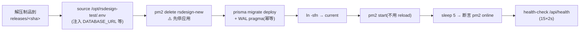

# 02 · CI 与自动部署流水线

> as-built（2026-07-11）。所有工作流与脚本都在仓库 `admin/rsdesign-new` 内、**本身也走 PR 评审**。本册解释每一步为什么长这样——多数设计都对应一次真实踩坑（编号见 [06-运维手册](06-运维手册与踩坑集.md)）。

v3 边界：AI 可以参与开发/测试环境的部署流程设计、首次真实部署、调试和回滚验收；流程验收后，常规测试部署和全部生产部署只运行确定性脚本。

本册只记录已经验证的 Linux/Next.js/SQLite/PM2 试点，不是通用平台默认。尤其是历史
`deploy-test.yml` 在 `gitea-ci` 启动 `rsdesign-new` 的做法已经被 Issue #21 的主机职责合同
判定为 legacy 违规：它在应用自身迁移验收前仍是 observed live state，但不得复制给新项目。
新流程在 `scm-ci` 只完成 checkout/build/test/package/publish，应用部署到独立
`appserver-test`。Windows 的目标应用为 IIS + ASP.NET Core + React `wwwroot` + PostgreSQL，
详细构建、制品和部署合同见 [12-Windows平台自动部署方案](12-Windows平台自动部署方案.md)；
迁移与验收分别见 [13](13-项目结果迁移与内网切换实施手册.md) 和 [14](14-Windows部署与迁移验收清单.md)。两类平台共用“PR 硬门、一次构建、不可变制品、配置外置、健康检查、备份与回滚”原则，但不能复用彼此的 PM2/SQLite 或 IIS/PostgreSQL 专属命令。

任何 workflow 或 wrapper 在 mutation 前调用固定安装路径：

```bash
/usr/local/libexec/aisoft/verify-host-role --action deploy --resource application
```

在 `role=scm-ci` 上该请求必须以退出码 `20` 拒绝；脚本不得捕获后继续。build/test/package/
artifact publish 使用 catalog 中对应的固定 action/resource，未知值、profile 权限错误、
hostname 或 machine-id 漂移都 fail closed。guard 不接受任意 shell，也不替调用方执行命令。

## 1. 目标应用的真实形态（决定一切口径）

| 事实 | 影响 |
|------|------|
| Next.js 14 单体全栈（App Router），**不是** backend/frontend 分离 | 命令全在仓库根：`npm ci` / `npm test` / `npm run build`；Nginx 纯反代无静态分流 |
| SQLite + Prisma（`DATABASE_URL` 支持覆盖，默认 `file:../storage/db/app.db` 相对 schema 解析） | 部署脚本一整套 SQLite 特有约束（见 §4） |
| 端口写死 3100；`"type":"module"` | PM2 配置必须 `ecosystem.config.cjs` |
| 包管理 npm（独立仓库有自己的 package-lock.json） | CI 用 `npm ci`；Verdaccio 缓存 |
| 字体 `@fontsource-variable/*` 自托管 | **构建零外网依赖**（🕳️ #1：next/font/google 会在构建期拉 Google Fonts 挂死） |

## 2. 两条工作流

### `.gitea/workflows/ci.yml` —— PR 检查（分支保护的硬门）

```
PR → npm ci → prisma generate → 空库 migrate deploy → npm test(Vitest 串行) → next build
```

- 状态 context 为 **`CI / test (pull_request)`**，分支保护按此名放行合并——改 workflow/job 名会连带影响保护规则，慎改。
- 空库迁移 + 测试：service 层测试直连 SQLite，`rm -f storage/db/app.db*` 后 `migrate deploy` 重建，保证每次可重现。
- docs-only 的 PR 也跑全量（顺带回归）。

### `.gitea/workflows/deploy-test.yml` —— 历史合并 main 同机部署

```
push(main) → npm ci → generate → build → pack.sh <sha> → deploy-local-test.sh <sha> → health-check.sh
```

这是 `rsdesign-new` 试点的 as-built，不是当前平台允许的新目标。迁移后的应用仓 workflow
应在 `scm-ci` 构建并发布带 checksum 的制品，再由独立、受保护的 AppServer 部署入口验证
`role=appserver-test` 后执行 deploy；对应改动必须在该应用自己的 Issue/分支/PR 中完成。

## 3. 制品（scripts/pack.sh）

```
rsdesign-new-<sha>.tar.gz  (~160MB,存 /opt/artifacts/)
├── app/
│   ├── .next/            # 构建产物(已剔除 .next/cache)
│   ├── node_modules/     # 仅生产依赖(npm ci --omit=dev;prisma CLI 在 dependencies,离线可迁移)
│   ├── prisma/           # schema + migrations + enable-wal.sql
│   ├── package.json / package-lock.json / next.config.mjs
└── ecosystem.config.cjs
```

关键守门：**打包前校验 `.next/BUILD_ID` 存在**（🕳️ #2：Next 收到 SIGTERM 会以 exit 0 退出，`bash -e` 的 CI 步骤误判成功，半成品混入制品）。

`/opt/artifacts` 只是 legacy staging，不等于可以按名称或年龄清理。retention inventory 必须
使用项目 allowlist、完整 commit SHA、计算得到的 checksum、当前 release/rollback/workflow
引用、最小保留数量与期限；默认只输出 dry-run/audit ledger。任何删除仍是独立人工 Gate。

> 为什么不用 Next standalone：`prisma migrate deploy` 在离线机需要完整 prisma CLI，standalone 裁剪后还得单独拼装迁移工具链；SQLite 单机场景制品体积不敏感，全量 node_modules 简单可靠。可作后续优化项。

## 4. Legacy 部署（scripts/deploy-local-test.sh）—— SQLite 约束全在这



迁移到 AppServer 时保留以下 SQLite 顺序，但在读取 `.env`、停止进程、迁移数据库、切换
symlink 或启动 PM2 之前，root-owned wrapper 必须先验证 `deploy/application`、
`use/business-database`、`run/migration`、`stop/application` 和 `start/application` 等固定
capability。`scm-ci` 不能通过这些检查；不能以“runner 过去能执行”为兼容理由绕过。

每步的「为什么」：

| 步骤 | 原因（实证编号见运维手册） |
|------|------|
| SQLite 库在 `shared/db/app.db`（releases 之外），`.env` 用**绝对** `file:` 路径 | 库随版本切换不丢；相对路径会解析到 release 内 |
| **先停应用再迁移** | 🕳️ #10：`migrate deploy` 要独占锁，运行中应用持连接 → `database is locked`。停机窗口 = 迁移+启动，秒级 |
| `pm2 delete + start`，不用 reload | 🕳️ #3：PM2 reload **不应用**新配置里的 cwd/script，会钉死旧 release |
| 部署后断言 `pm2 jlist` 里进程 `online` | 🕳️ #4：健康检查可能被同端口野生进程骗过（发生过） |
| 迁移后执行 `enable-wal.sql`（幂等） | WAL 模式提升读写并发；注意 WAL 下备份要用 `sqlite3 .backup` 而非 cp |
| 单实例 fork（不用 cluster） | SQLite 单写者约束；「零停机」让位于确定性 |

环境文件 `/opt/rsdesign-test/.env`（gitea-runner 属主、600、不进 git）：`DATABASE_URL`、`RS_STORAGE_DIR`、`SAP_RFC_MOCK_MODE=true`、PDF resolver 配置、`NODE_ENV=production`、`NEXT_TELEMETRY_DISABLED=1`。

## 5. 回滚

| 层面 | 方式 |
|------|------|
| 应用 | `releases/` 按 sha 多版本保留：`ln -sfn releases/<旧sha> current && pm2 delete rsdesign-new && pm2 start current/ecosystem.config.cjs --env production` |
| 数据库 | 迁移前备份（`sqlite3 app.db ".backup <file>"`）；迁移设计要求向后兼容（先加列不删列，下线分两步） |
| 流程 | Gitea revert PR → 触发正常部署流程 |

## 6. 历史 `prod-sim` promote（已冻结，等待退役验证）

`scripts/promote-to-prod.sh <sha>` 曾设计为以 gitea-runner 身份在 gitea-ci 上手动运行，
rsync 制品到 `deployer@prod-sim.orb.local:/opt/incoming/`，再远程执行生产脚本。

**当前状态（2026-08-02 删除 Gate 前）**：live bare repo 仍含该目标字符串，但此前证据显示
`prod-sim` 侧 `/opt/rsdesign-prod`、SQLite `deploy-prod.sh` 和 SSH 通道从未建成。用户已授权
Issue #21 在 AC-10 身份、依赖、唯一数据和可重建检查全部通过后精确退役 `prod-sim`，因此
这个脚本不得再触发，也不能继续作为“下一个待办”。应用仓应在自己的 Issue/PR 中删除或
替换 stale target；新生产目标必须有 `appserver-prod` profile、不可变制品和独立审批合同。
计划或仓库字符串不证明 VM 已删除，最终状态见 Issue #21 verification。

## 7. 首次部署与部署变更验收

CI、制品、迁移、健康检查或回滚属于 complex 变更，必须有 Issue、`00-summary.md`、`01-spec.md`、`02-plan.md` 和 `03-verification.md`。

建设期允许人在 AI 协助下执行开发/测试环境的真实命令，直到所有有效操作固化为版本化脚本。进入生产前至少验证：

- 从可重复的干净状态执行完整脚本成功。
- 连续执行两次，确认重复运行不会破坏环境或数据。
- 构建制品带 commit SHA，测试和生产使用相同字节。
- 环境变量和凭据未进入制品或日志。
- 迁移前备份可恢复。
- PM2 online 断言和 HTTP health check 都生效。
- 故意制造一次迁移、启动或健康检查失败，并验证停止/回滚路径。
- `bash -n`、ShellCheck（若可用）和部署 smoke test 有真实结果。

`03-verification.md` 记录执行环境、命令、结果、失败演练、回滚结果和遗留风险。AI 手工协助部署成功不等于验收；最终必须证明不调用模型也能只靠脚本完成。

生产部署失败时，脚本先停止并执行既定回滚。AI 只能读取脱敏证据，在开发/测试环境复现和修复版本化脚本，经 PR、CI 和非生产验收后再由人重新触发生产脚本。

## 8. 观察一次部署

```bash
# Actions 运行状态(API)
TOKEN=$(grep "admin token:" ~/gitea-ci-credentials.txt | awk '{print $NF}')   # VM 内
curl -fsS -H "Authorization: token $TOKEN" \
  http://127.0.0.1:3000/api/v1/repos/admin/rsdesign-new/actions/tasks \
  | jq '.workflow_runs[0] | {id, workflow_id, status, head_sha}'
# 日志落盘(zstd 压缩)
sudo zstd -dc /var/lib/gitea/data/actions_log/admin/rsdesign-new/<xx>/<id>.log.zst | tail -50
```

## 9. 部署成功后的 Issue 记账

目标应用可在健康检查成功后调用版本化
`codex/tools/mark-deployed-issues.sh`。工具读取 merge message 中每个独立成行的
`Closes #N`，保留 type、complexity 与非生命周期标签，仅把生命周期推进为
`deployed`。回写是 best-effort：失败必须告警，但不能把已经成功的应用部署改判
失败。每个应用仓库须通过自己的 Issue/PR 接入，平台仓库不直接替它修改 workflow。
