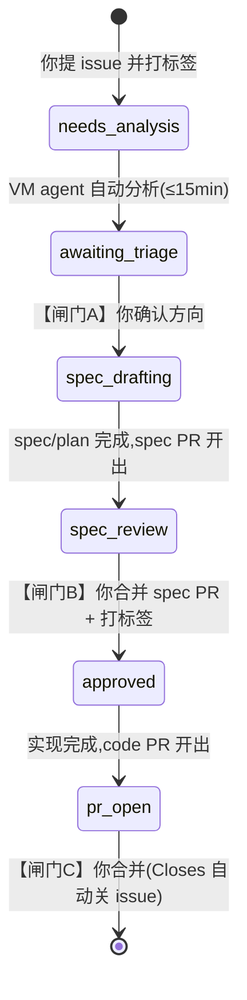

# 03 · Spec 驱动工作流与三道闸门

> 平台的日常使用手册。核心思想：**issue 号 N 是唯一主键**，spec/plan 以 `docs/changes/<N>/` 进仓库、与 issue 双向链接、随 PR 一起被审查；标签驱动生命周期；spec/plan 就是喂给任何 agent 的「意图接口」——换 Claude/Codex 不影响流程。

## 1. 绑定模型

```
issue #N ──双向链接── docs/changes/N/{00-summary,01-spec,02-plan}.md
   │                        │
   ├── 分支 spec/N(文档) ← 独立 docs-only spec PR(Refs #N,合并不关 issue)
   ├── 分支 change/N(代码) ← code PR(Closes #N,合并自动关 issue)
   └── 提交信息 (#N) / PR 正文引用 / 部署记录
```

- 文件夹名用**纯数字 N**（脚本解析用）；文件用 `00/01/02` 前缀固定阅读顺序。
- front-matter（issue 号、gitea_url、status、branch）让绑定可机读；模板在 `docs/changes/_template/`。
- **spec PR 与 code PR 分离**：改意图比改代码便宜一个数量级，闸门 B 因此是「最值钱的一道审查」。

## 2. 标签状态机



- **只有 `needs-analysis` 触发自动化**（`approved` 的自动实现腿已停用，见 §4）；其余标签是状态标记。
- Gitea 标签本是多选集合，七个流程标签靠**约定互斥**：自动流转会删旧加新；**人工打标签时请顺手摘掉上一个**，保持一眼可读。
- `deployed` 标签当前需手动打（deploy 自动回帖是待办增强）。

## 3. 三道闸门操作卡

| 闸门 | 你看什么 | 你做什么 |
|------|----------|----------|
| **A · 确认方向** | issue 里 🤖 分析评论：影响范围是否靠谱、方案倾向对不对 | 对 → 打 `spec-drafting`（摘掉 awaiting-triage）；不对 → 评论说明 + 重打 `needs-analysis` |
| **B · 批准 spec**（最关键） | spec PR：`01-spec.md` 的**验收标准是否可测**、`02-plan.md` 任务分解与涉及文件是否合理 | 合并 spec PR → 给 issue 打 `approved` |
| **C · 批准代码** | code PR：diff 与 spec/plan 对照（三者同 repo 可并排看）；CI 必须绿（分支保护强制） | 合并 → 自动部署 → 验证 http://gitea-ci.orb.local:8091 |

## 4. 分工现状（2026-07-11 演进）

| 环节 | 执行者 | 说明 |
|------|--------|------|
| issue 分析 | **VM 无人值守**（poll → analyze.sh，headless claude 只读） | 产出 00-summary 到 spec/N + 评论 |
| brainstorm → spec/plan | **Mac 本机交互**（Claude Code / Codex + 你） | 在 `~/Projects/rsdesign-new` 克隆上做，产出推 spec/N；也可用 VM 的 `spec-start.sh`（交互认证体验差，不推荐） |
| 实现 | **Mac 本机交互** | 读 main 上的 spec/plan，TDD，`npm test` 过了才开 PR |
| 无人值守实现 | 停用待命 | `poll.sh` 内已注释；恢复即回到 2.6 原设计，或按 Part H 换 Codex |

> 为什么交互环节放 Mac：VM 里 claude 交互模式要浏览器 OAuth（headless `-p` 不受影响）；且开发者的编辑器、习惯、多 agent 工具都在本机。**流水线不关心提交来自谁**——这正是 spec 作为「意图接口」的意义。

## 5. 实例走查：issue #4（2026-07-11 实测记录）

1. 提 issue「项目列表增加最近更新时间列」+ `needs-analysis`
2. agent 15 分钟内产出 `00-summary.md`（准确定位 `lib/projects/service.ts` 等文件与行号、给出两种方案）→ `awaiting-triage`
3. 闸门 A：确认方向 → `spec-drafting`
4. Mac 会话 brainstorm 收敛 3 个决策（查询时聚合 / 可点排序默认不变 / YYYY-MM-DD）→ 写 `01-spec.md`（8 条可测验收标准）+ `02-plan.md` → spec PR #5 → `spec-review`
5. 闸门 B：合并 #5 + `approved`
6. Mac 会话按 spec 实现（`$queryRaw` 全表 GROUP BY 聚合，绕开 SQLite 999 变量上限；含分页陷阱处理）→ 测试全绿 → code PR #6 → `pr-open`
7. 闸门 C：合并 #6 → 自动部署 run #19 绿 → issue 被 `Closes #4` 自动关闭 → 页面可见新列
8. 途中还顺带揪出并修复了部署锁 bug（PR #7，🕳️ #10）——流水线的红灯是真红灯

## 6. 日常速查

```bash
# 提需求:Gitea 建 issue → 打 needs-analysis → 等邮件/评论
# 手动触发一轮轮询(不想等 15 分钟):
orb -m gitea-ci sudo -u coder bash -c 'source ~/.agent.env && ~/agent/poll.sh'
# Mac 上开始 spec/实现(以 issue N 为例):
cd ~/Projects/rsdesign-new && git fetch origin
git checkout spec/N   # spec 阶段;实现阶段: git checkout -b change/N origin/main
```
