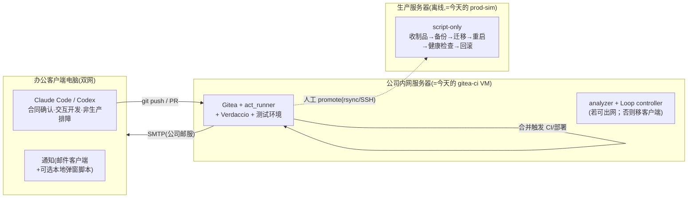

# 07 · 内网与生产平移路线

> 「原型优先，逐级平移」的后半程。OrbStack 原型已把全链路（含 6+ 个必踩坑）验证完毕——平移 = **同样的安装步骤 + 同样的脚本 + 只改各机 `.env`/地址**。

## 1. 目标拓扑（已确认的方向）

角色映射：**Mac → 办公客户端**（装 AI 工具 + 访问内网 Gitea）；**gitea-ci VM → 内网服务器**；**prod-sim → 生产服务器**。OrbStack VM 保留为本地沙盒——以后改部署脚本先在 VM 验证再动内网。

## 2. 平移前提清单（到时逐项确认）

- [ ] 客户端电脑双网可达：内网 Gitea(HTTP+git) + AI API（Anthropic/OpenAI，可配 `HTTPS_PROXY`）
- [ ] 内网服务器能否出网到 AI API → 决定 analyzer/Loop controller 放服务器还是办公客户端；生产服务器永远不需要 AI API
- [ ] 生产机 `openssl version` + `uname -m` → 核对 Prisma `binaryTargets`（amd64 Ubuntu 22.04+ = `debian-openssl-3.0.x`，已预配）
- [ ] Node 大版本三处一致（客户端构建无关紧要；**内网构建机与生产机必须一致**，现为 Node 20）
- [ ] 公司 SMTP relay 地址 → 改 `app.ini [mailer]` 四行（见 05）
- [ ] 生产机若从未联网：在内网服务器 `apt-get download` 备好离线 .deb 集（node/postgres 不需要——应用是 SQLite；需要 nginx/sqlite3/pm2 的 npm 离线包）

## 3. 平移步骤概览

1. **内网服务器**：照 [01](01-基础设施-VM-Gitea-Runner.md) 重演安装（Gitea/act_runner/Verdaccio/Mailpit→公司SMTP）；迁移仓库（`git push --mirror`）；重注册 runner；重建 `/opt/rsdesign-test` + `.env`
2. **客户端**：克隆仓库、装 AI 工具、（可选）通知脚本；`.npmrc` registry 指向内网 Verdaccio
3. **生产服务器**：照 prod-sim 彩排过的流程装运行时 + `deploy-prod.sh` + 窄 sudoers + SSH 通道；首次 promote 验证「离线迁移 + 重启 + 回滚」
4. 每步的验收命令沿用各册「冒烟清单」

## 4. 待办增强（按优先级）

| 优先级 | 事项 | 说明 |
|--------|------|------|
| ★★★ | **prod-sim 离线彩排** | 平移生产前必做：建 `/opt/rsdesign-prod`、SQLite 版 `deploy-prod.sh`（备份用 `sqlite3 .backup`、先停后迁）、SSH 通道、断网 promote + 故意失败回滚各一次 |
| ★★★ | **Codex Development Loop 试点** | 先完成 small/complex、自修复、升级、CI feedback 和非生产首次部署验证，再接 Claude adapter |
| ★★★ | **部署/回滚结果通知** | 回帖关联 Issue 或使用 workflow 通知，覆盖失败、回滚和恢复结果 |
| ★★ | `docs/changes` 合同校验 | 所有变更要求 summary；complex 要求 spec/plan；部署/迁移要求 verification |
| ★ | deploy-test.yml 加 `paths-ignore: ["docs/**"]` | 纯文档合并不再触发完整部署（🕳️ 11） |
| ★ | Mac 弹窗通知 watcher | launchd + terminal-notifier，邮件不够实时时再加 |
| ★ | 制品瘦身（Next standalone + 独立迁移工具链） | 160MB→~40MB，非必需 |
| ★ | 每日 SQLite 定时备份 + 异地留存、pm2-logrotate、轻量监控 | 原方案「阶段 5 加固」项 |

## 5. 试点结论（给未来的自己）

- 三层架构、不可变制品、最终 PR 合并和确定性生产部署已经在真实项目上证明可行；v3 不再要求独立 spec PR 或三道硬闸门。
- AI 可以参与非生产首次部署和故障复现；生产保持 script-only。Analyzer/Loop 可以按网络条件放专用服务器或办公客户端，但必须使用相同 controller 和 verifier 合同。
- OrbStack 原型阶段拦下的 14 个坑（见 06）每一个都会在内网重现——平移时对照踩坑集逐条自检，就是这套原型策略的全部回报。
