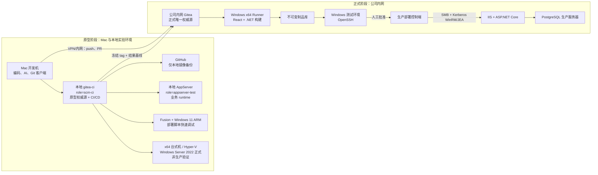

# 07 · 内网与生产平移路线

> 状态：目标架构已确认，尚未实施。本文统一 Linux 既有试点与 Windows 新目标的平移原则；Windows 详细设计见 [12](12-Windows平台自动部署方案.md)，迁移操作见 [13](13-项目结果迁移与内网切换实施手册.md)，验收见 [14](14-Windows部署与迁移验收清单.md)，Mac 快速原型见 [15](15-VMware-Fusion-Windows-ARM原型实施手册.md)。

## 1. 核心决策

平台采用“原型孵化、结果迁移、权威源切换”模型：

1. 新项目先在 Mac、本地 Gitea 和非生产测试机上完成开发与自动化部署原型。
2. 本地 Gitea 是原型阶段权威源；GitHub 只接收本地 Gitea 的镜像备份。
3. 迁移不复制本地 Issue、PR、评论和账号，只交付可重复构建的项目结果。
4. 公司内网 Gitea 从迁移完成起成为项目唯一正式权威源，与 GitHub 无连接。
5. 迁移后仍在 Mac 开发，但分支、PR、CI、制品和发布记录全部进入公司内网 Gitea。
6. 生产环境只执行版本化、已验证、可回滚的确定性脚本，不安装或调用 AI。
7. 公司内网 Gitea 复用本地的仓库分类策略：默认 private；只有经平台 Issue/PR 写入 public
   allowlist 的平台/测试仓库可以 public。当前逻辑例外仅 `aisoft-platform`、`myapp`、`smoke-test`；
   公司内部应用保持 private。
8. 公司环境重新创建 platform manager、每项目 agent、人工 reviewer 和 deploy identities；不复制
   本地账号、PAT、SSH key 或 Secret。最终 PR merge 仍只允许人工身份。

“结果”至少包括完整源代码、目标分支历史与发布标签、workflow、部署脚本、数据库 migration、测试、lock file、技术文档和迁移清单。原型制品、Secret、Runner 注册和环境配置不作为结果迁移。

## 2. 双阶段拓扑



本地 `gitea-ci` 只承担 `scm-ci`；业务 Web/API/worker、业务数据库和长驻 smoke 必须位于
独立 AppServer 或一次性隔离测试环境。`prod-sim` 是早期彩排 VM，Issue #21 已获得在
name+ID、依赖、唯一数据和重建证据全部通过后的精确退役授权；删除验证完成前它仍是 live，
但不得再作为新脚本目标。Fusion Windows 11 ARM 和 x64 Windows Server VM 继续作为分层
非生产沙盒；它们都不构成公司生产信任边界。

所有 Linux 主机使用同一 versioned host-role schema/capability catalog：

- `scm-ci`：checkout/build/test/package/publish、Runner、缓存、通知和受控制品；
- `appserver-test`：只消费已批准制品，执行非生产 deploy/migration/start/health/rollback；
- `appserver-prod`：只消费测试证明匹配的制品，运行确定性生产脚本。

root-owned profile 同时绑定 hostname 与 machine-id；deploy/start/database mutation 在执行前
调用固定 guard。未知 capability、profile 权限过宽或 identity mismatch 都 fail closed。

## 3. 权威源切换

迁移前 Mac 仓库：

```text
origin  -> 本地 Gitea
github  -> GitHub 镜像
```

迁移后 Mac 仓库：

```text
origin     -> 公司内网 Gitea
prototype  -> 本地 Gitea，只读历史，可选
```

切换后禁止两个 Gitea 同时接收正式提交。公司 Gitea 接受第一个新提交或 PR 后即越过简单回切点；此后故障应从公司备份恢复，不能重新启用本地旧副本作为权威源。

## 4. 编号与追踪

Gitea 原生 `#N` 只负责当前仓库内部的自动关联。平台另使用短 Change ID：

```text
原型阶段：<项目三字符代码>-NNNN，例如 RSD-0008
公司正式阶段：PRD-NNNN，例如 PRD-0001
```

每个项目仓库独立编号，不按年份重置，不复用已使用编号。正式绑定示例：

```text
Issue title: [PRD-0001] 接收原型基线并建设正式部署链
Branch:      change/PRD-0001
Documents:   docs/changes/PRD-0001/
PR body:     Change-ID: PRD-0001 + Closes #1
Artifact:    MyApp-PRD-0001-<commit-sha>-win-x64.zip
```

原型与正式编号不要求一一对应；确有来源关系时记录 `source_change_id`。本设计是 Windows 项目正式接入时的目标合同，现有 runtime 仍按 `change/N` 工作，必须在独立的平台实现变更中完成兼容后才能启用新格式。

## 5. 两类目标平台

### 5.1 Linux 新项目默认与既有试点

新 Linux 项目采用 Docker-first、项目无关的 release contract：

- 受控 `linux/amd64` builder 一次构建并发布 immutable OCI digests；test/prod 不现场 build、
  安装依赖、拉源码或访问公网。
- Gitea Container Registry 与完全离线 bundle 是同一 `release.json` 的两个 transport；
  production promotion 不重新生成“等价”image。
- 两个 transport 最终使用同一 release-scoped runtime tag 与 exact content image ID；offline
  archive 按 tag save/load，不把目标 daemon 是否恢复 Registry `RepoDigests` 当合同。
- `release.json` 绑定完整 Gitea merge SHA、Compose checksum、#23 architecture
  `profile_id/catalog_revision/lock checksum`、service digests 和 migration identity。
- 新 adoption 发布 `docker-release/v2` 与 producer-normalized Compose model，使 artifact verification
  不读取 target profile/Docker/Compose binary；target readiness、stage、migrate、activate/health、
  status、rollback 分开授权和记录。既有 v1 只能走 legacy 兼容入口，不原地补写 v2 字段。
- `scm-ci` 只 build/publish/verify；业务容器只允许在 `appserver-test`/`appserver-prod`。
- Nginx 与 PostgreSQL 按环境共享，每应用使用独立 database/runtime/migrator/backup role；
  环境 Secret 与 release bytes 分离。
- 应用回切不自动恢复 PostgreSQL；破坏性 migration、database restore 和 production promotion
  都保留独立人工 Gate。
- `docker-release-state/v2` staging/migration receipt 不等于 deployment；Compose 5.1.4 只有在同等级
  disposable real Engine 29/containerd E2E 与 committed evidence 后才能进入 supported matrix。

平台 candidate、fake Docker tests 或 catalog dry-run 不能替代公司 Registry、offline media、
AppServer、网络/TLS、备份恢复和 production 验收。具体 contract/CLI 见
[docker-release/README.md](docker-release/README.md)，完整 Linux 拓扑见
[12-Linux GitHub → Gitea 方案](12-Linux-GitHub-Gitea-双服务器自动部署方案.md)。

`rsdesign-new` 的 Next.js、SQLite、PM2、Nginx 和 tar.gz 流程仍是已验证的试点证据，详细
约束见 [02](02-CI与自动部署流水线.md)。其中在 `gitea-ci` 启动测试 runtime 的部分已被
host-role 合同降级为待迁移 legacy；AppServer 迁移、数据和回滚未真实验收前不得写成完成。

### 5.2 Windows 新目标

Windows 基线为：

- Windows Server 2019+，测试优先使用 Windows Server 2022 x64。
- IIS + ASP.NET Core + React `wwwroot` 单制品。
- PostgreSQL；生产数据库与 IIS 分机，小型非生产环境可同机。
- 测试环境使用 OpenSSH 传输和执行。
- 生产环境使用 SMB 传输、Kerberos WinRM 和 JEA 限权执行。
- 允许短暂计划停机窗口完成 migration、切换与启动。

原型按三层推进：

1. Mac 上 VMware Fusion + Windows 11 ARM：快速调试 IIS、OpenSSH、PowerShell 状态机和 `win-arm64` 原型制品。
2. Windows x64 台式机上的 Hyper-V + Windows Server 2022：重新验证 `win-x64`、Server Feature、OpenSSH 和 PostgreSQL x64。
3. 公司 AD 环境：验证 SMB、Kerberos WinRM、JEA、备份恢复和生产彩排。

第一层的详细步骤见 [15](15-VMware-Fusion-Windows-ARM原型实施手册.md)。ARM 与 x64 制品不是相同字节，ARM 结果不能越过第二、三层 Gate。

## 6. 平移阶段

| 阶段 | 主要工作 | 退出条件 |
|---|---|---|
| A. 原型收敛 | 本地 Gitea 完成源码、workflow、Windows 测试部署与回滚 | 创建 handoff tag，所有结果已版本化 |
| B. 内网基础设施 | 新建公司 Gitea、Windows Runner、依赖缓存、测试服务器 | 无生产凭据，Runner 可完成干净构建 |
| C. 结果迁移演练 | 一次性推送项目结果，重建权限、Secret、保护规则 | SHA、tags、LFS、workflow 校验一致 |
| D. 正式测试 | 内网重新构建制品，OpenSSH 部署两次并故意失败 | [14](14-Windows部署与迁移验收清单.md)测试项通过 |
| E. 生产彩排 | SMB、Kerberos、WinRM、JEA、数据库备份恢复 | 同一制品完成计划停机发布和回滚演练 |
| F. 权威切换 | 冻结本地、最终同步、Mac remote 改向公司 | 公司 Gitea 成为唯一正式入口 |

## 7. 生产边界

- Gitea/通用 Runner 所在 `scm-ci`、测试 AppServer、部署控制端、生产 runtime 和 PostgreSQL 按职责隔离。
- Gitea platform manager 只对显式受管仓库 Admin；每项目 agent 只对本项目 Write。Gitea PAT 不得
  复用为 SSH/sudo/WinRM/JEA/数据库凭据；测试与生产 deploy identities 按项目和环境分别建立。
- public/private 由迁移 mapping 的业务分类决定，不由目标 Gitea 当前可见性、仓库名称或匿名可达性
  推导。未知目标仓库在 inventory 中只报告，等待独立批准。
- 生产 IIS 服务器不安装 Git、.NET SDK、Node 构建工具、通用 Runner、Codex 或 Claude Code。
- 通用 CI Runner 不持有生产管理员权限；生产发布只经专用部署控制端和 JEA Endpoint。
- 测试和生产使用同一制品字节；生产不得重新编译。
- React 使用同源 `/api` 或运行时配置，不能把测试/生产地址写入构建产物。
- 数据库 migration 使用独立角色；应用回滚与数据库恢复是两个不同决策。

## 8. 回滚边界

| 失败点 | 回退方式 |
|---|---|
| 结果迁移尚未切换 | 停止公司暂存环境，继续使用本地 Gitea |
| 公司已接受新提交 | 从公司 Gitea 备份恢复，不回切本地旧副本 |
| 测试部署失败 | 保留当前版本，删除或隔离失败 release |
| 生产启动/健康失败 | 切回上一应用 release；数据库仅按预案恢复 |
| migration 破坏兼容 | 停止发布并人工决策；依赖 expand/contract 和已验证备份 |

## 9. 实施入口

- Windows 架构、制品、目录、身份与部署合同：[12-Windows平台自动部署方案](12-Windows平台自动部署方案.md)
- Linux Docker-first release contract：[docker-release/README.md](docker-release/README.md)
- 结果迁移、内网重建、切换与回退步骤：[13-项目结果迁移与内网切换实施手册](13-项目结果迁移与内网切换实施手册.md)
- 所有真实验收项和证据模板：[14-Windows部署与迁移验收清单](14-Windows部署与迁移验收清单.md)
- Mac 上 Fusion + Windows 11 ARM 快速原型：[15-VMware Fusion Windows ARM 原型实施手册](15-VMware-Fusion-Windows-ARM原型实施手册.md)

这些文档只定义目标和实施合同，不表示 Windows Runner、OpenSSH、SMB、WinRM、JEA 或生产部署已经建成。

## 10. Architecture catalog 采用门

项目进入公司内网前，先从 [`architecture/catalog.json`](architecture/catalog.json) 选择一个
versioned profile，提交 `.aisoft/architecture.json` 和生成的 `architecture.lock.json`。迁移
handoff 只引用 `profile_id`、`catalog_revision` 和 lock checksum；host role/capability 属于
#21，release/deploy state 属于 #22，不能复制进 lock。

Catalog candidate 不会自动修改 package lock、Dockerfile、schema、image、server 或 database。
OS/runtime/framework/ORM/database/container major adoption 必须在应用自己的 complex Change 中
完成兼容、backup/restore、rollback 和人工合并。Windows 必须保持 .NET/ASP.NET Core/EF Core
同 major；SQLite 只适用于单实例、本机磁盘、一个 writer 且有 online backup/restore drill 的
小型应用。离线导入必须保存官方 source、checksum/signature、SBOM/provenance 和 OCI digest。
## GitHub 入站同步候选

版本化 `sync/` 组件实现 GitHub allowlisted `refs/heads/main` 到不可变
`sync/github/<full-sha>` 和 Gitea PR 的单向候选传输。它不镜像审批、不写或合并
Gitea `main`，每项目只允许一个活跃 sync PR；后续 SHA 记录为 pending。
`sync/install.sh` 只安装 root-owned runtime、profile 示例和 systemd 模板，不创建
credential，也不 enable/start timer。真实项目必须先完成身份权限读回和 one-shot
验收，才能另行批准启用 timer。
