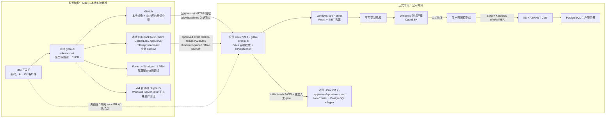

# 07 · 内网与生产平移路线

> 状态：Linux 平台侧交付合同（host-role guard、docker-release、architecture catalog）已实现并进入 protected `main`；NewEmaint 两台公司 VM operator workflow 仅为仓库合同，公司内网实施与 Windows 目标尚未开始。本文统一 Linux 既有试点与 Windows 新目标的平移原则；Windows 详细设计见 [12](12-Windows平台自动部署方案.md)，迁移操作见 [13](13-项目结果迁移与内网切换实施手册.md)，验收见 [14](14-Windows部署与迁移验收清单.md)，Mac 快速原型见 [15](15-VMware-Fusion-Windows-ARM原型实施手册.md)。

## 1. 核心决策

平台采用“原型孵化、双权威持续协作”模型（2026-08-11 用户确认，详见
[13 §0](13-项目结果迁移与内网切换实施手册.md)）：

1. 新项目先在 Mac、本地 Gitea 和非生产测试机上完成开发与自动化部署原型。
2. 本地 Gitea 是**开发权威**并长期保留：Issue、判级、实现、最终 PR 与人工合并全部在
   开发侧；AI 只存在于开发侧。GitHub 是本地镜像与向公司内网的搬运中继。
3. 同步不复制本地 Issue、PR、评论和账号，只持续交付可重复构建的项目结果与部署脚本。
4. 公司内网 Gitea 是**部署权威**：经 `scm-ci` 从 GitHub 拉取 allowlisted refs 入站
   （12-Linux §8 / `sync/` 子系统），内网重新创建 PR、运行 CI/verification 并由人合并后，才有资格
   申请独立的确定性交付阶段；内网不安装
   或调用 AI。GitHub 不进入公司信任链。
5. 新的 Issue、修改和提交始终在开发机进行；内网故障以脱敏证据包回流开发机建 Issue。
   一次性「唯一权威源切换」保留为备选的彻底下线路径（13 §11），当前不采用。
6. 生产环境只执行版本化、已验证、可回滚的确定性脚本，不安装或调用 AI。
7. 公司内网 Gitea 复用本地的仓库分类策略：默认 private；只有经平台 Issue/PR 写入 public
   allowlist 的平台/测试仓库可以 public。当前逻辑例外仅 `aisoft-platform`、`myapp`、`smoke-test`；
   公司内部应用保持 private。
8. 公司环境重新创建 platform manager、每项目 agent、人工 reviewer 和 deploy identities；不复制
   本地账号、PAT、SSH key 或 Secret。最终 PR merge 仍只允许人工身份。
9. NewEmaint pilot 固定为两台公司 Linux VM：`gitea-ci/scm-ci` 与
   `appserver/appserver-prod`；`appserver-test` 位于本地 OrbStack NewEmaint DockerLab。开发侧把本地已
   验证的 exact `docker-release/v2` bytes 做成 checksum-pinned offline bundle；公司要求内网重建且无
   隔离测试环境时固定 `BLOCKED`，不同 bytes 不得冒充已测试制品。

“结果”至少包括完整源代码、目标分支历史与发布标签、workflow、部署脚本、数据库 migration、测试、lock file、技术文档和迁移清单。原型制品、Secret、Runner 注册和环境配置不作为结果迁移。

## 2. 双阶段拓扑



本地 `gitea-ci` 只承担 `scm-ci`；业务 Web/API/worker、业务数据库和长驻 smoke 必须位于
独立 AppServer 或一次性隔离测试环境。早期 `prod-sim` 彩排 VM 已在 2026-08-04 按 Issue #21
完成 name+ID、依赖、唯一数据、可重建与 paired-health 验证后精确退役，不是当前拓扑，也不得
再作为脚本目标。Fusion Windows 11 ARM 和 x64 Windows Server VM 继续作为分层
非生产沙盒；它们都不构成公司生产信任边界。

所有 Linux 环境使用同一 versioned host-role schema/capability catalog；role 必须隔离，但不要求每个
role 都对应一台公司 VM：

- `scm-ci`：checkout/build/test/package/publish、Runner、缓存、通知和受控制品；
- `appserver-test`：只消费已批准制品，执行非生产 deploy/migration/start/health/rollback；
- `appserver-prod`：只消费测试证明匹配的制品，运行确定性生产脚本。

root-owned profile 同时绑定 hostname 与 machine-id；deploy/start/database mutation 在执行前
调用固定 guard。未知 capability、profile 权限过宽或 identity mismatch 都 fail closed。

采用两台公司 VM 路径的项目，其 `appserver-test` 位于本地 OrbStack DockerLab；公司侧只有上述两台 VM。通用
operator runbook、inventory/handoff/evidence schema 和所有 company/live `NOT RUN` 边界见
[`company-delivery/runbook.md`](company-delivery/runbook.md)。

## 3. 权威分工与备选切换

当前采用 13 §0 的持续协作模型，不切换 Mac remote：

```text
origin  -> 本地 Gitea（开发权威）
github  -> 私有 GitHub（搬运中继）
公司 Gitea <- 公司 scm-ci 从 GitHub 拉取 allowlisted refs（部署权威）
```

本地 Gitea 长期接收 Issue、提交和最终 PR；公司 Gitea 只接收入站 sync PR 与部署审计，双方
按职责并存，不存在“公司接受首个 PR 后本地停止正式写入”的切换点。

### 3.1 备选彻底下线路径（当前不采用）

只有未来决定彻底下线本地开发平台并单独批准 [13 §11](13-项目结果迁移与内网切换实施手册.md#11-phase-h最终权威切换备选路径当前不采用)
时，才冻结本地写入并把 Mac remote 切换为：

```text
origin     -> 公司内网 Gitea
prototype  -> 本地 Gitea，只读历史，可选
```

该备选切换完成后才禁止两个 Gitea 同时接收正式开发提交；公司接受首个新开发 PR 后，故障从
公司备份恢复，不重新启用本地旧副本作为权威源。

## 4. 编号与追踪

Gitea 原生 `#N` 只负责当前仓库内部的自动关联。平台另使用短 Change ID：

```text
原型阶段：<项目三字符代码>-NNNN，例如 RSD-0008
公司正式阶段：PRD-NNNN，例如 PRD-0001
```

每个项目仓库独立编号，不按年份重置，不复用已使用编号。正式绑定示例：

```text
Issue title: [PRD-0001] 接收原型基线并建设正式部署链
Branch:      change/PRD-0001
Documents:   docs/changes/PRD-0001/
PR body:     Change-ID: PRD-0001 + Closes #1
Artifact:    MyApp-PRD-0001-<commit-sha>-win-x64.zip
```

原型与正式编号不要求一一对应；确有来源关系时记录 `source_change_id`。本设计是 Windows 项目正式接入时的目标合同；现有 runtime 使用 `change/N-short-description`（证据驱动兼容 legacy `change/N`），尚不接受 `change/PRD-NNNN`，必须由独立的平台实现变更后才能启用正式 Change ID 格式。

## 5. 两类目标平台

### 5.1 Linux 容器化交付参考与既有试点

Linux 容器化项目可选用 `docker-release/` 的 Docker-first、项目无关 release contract 作为参考实现；交付形态由
项目 `AGENTS.md`「项目事实」与 architecture 声明，平台不设默认（环境级原则见
`skill-for-codex/references/onboarding-runbook.md` §4）。该 contract 的要点：

- 受控 `linux/amd64` builder 一次构建并发布 immutable OCI digests；test/prod 不现场 build、
  安装依赖、拉源码或访问公网。
- Gitea Container Registry 与完全离线 bundle 是同一 `release.json` 的两个 transport；
  production promotion 不重新生成“等价”image。
- 两个 transport 最终使用同一 release-scoped runtime tag 与 exact content image ID；offline
  archive 按 tag save/load，不把目标 daemon 是否恢复 Registry `RepoDigests` 当合同。
- `release.json` 绑定完整 Gitea merge SHA、Compose checksum、#23 architecture
  `profile_id/catalog_revision/lock checksum`、service digests 和 migration identity。
- 新 adoption 发布 `docker-release/v2` 与 producer-normalized Compose model，使 artifact verification
  不读取 target profile/Docker/Compose binary；target readiness、stage、migrate、activate/health、
  status、rollback 分开授权和记录。既有 v1 只能走 legacy 兼容入口，不原地补写 v2 字段。
- `scm-ci` 只 build/publish/verify；业务容器只允许在 `appserver-test`/`appserver-prod`。
- Nginx 与 PostgreSQL 按环境共享，每应用使用独立 database/runtime/migrator/backup role；
  环境 Secret 与 release bytes 分离。
- 应用回切不自动恢复 PostgreSQL；破坏性 migration、database restore 和 production promotion
  都保留独立人工 Gate。
- `docker-release-state/v2` staging/migration receipt 不等于 deployment；Issue #65的task-owned disposable
  real E2E只授权Engine `[29.7.1,29.7.2)`、Compose `[5.1.4,5.1.5)`、linux/amd64/containerd exact
  supported row，不外推Compose其它5.x、classic或业务部署。

平台 source、fake Docker tests 或 catalog dry-run 不能替代公司 Registry、offline media、
AppServer、网络/TLS、备份恢复和 production 验收。具体 contract/CLI 见
[docker-release/README.md](docker-release/README.md)，完整 Linux 拓扑见
[12-Linux GitHub → Gitea 方案](12-Linux-GitHub-Gitea-双服务器自动部署方案.md)。

某项目采用两台公司 VM + 本地非生产 role 的物理放置属项目级例外，不改变三 role capability：本地 DockerLab
先验证 exact `docker-release/v2` bytes，再由 versioned + checksum-pinned operator bundle 受控搬入公司；公司
`scm-ci` 只做 artifact-only verification，公司 `appserver-prod` 只经 fixed target gate 消费相同 bytes；公司
要求内网重建但没有隔离测试环境时固定 `BLOCKED`。通用 operator 合同（含 Gitea `greenfield-isolated-install`
候选路径）见 [company-delivery runbook](company-delivery/runbook.md)；采用该路径的项目，其拓扑、operator
版本与 Stage 进度由项目仓记录，pilot 历史见 [archive](archive/company-delivery-pilot-历史-20260903.md)。

`rsdesign-new` 的 Next.js、SQLite、PM2、Nginx 和 tar.gz 流程仍是已验证的试点证据，详细
约束见 [02](02-CI与自动部署流水线.md)。其中在 `gitea-ci` 启动测试 runtime 的历史做法已按
Issue #21 于 2026-08-04 完成向独立 AppServer 的迁移与旧 runtime 清理（见 01 §1 端口表与
`docs/changes/21/03-verification.md`）；后续环境健康仍须实时只读复核，不得凭本册推定。

### 5.2 Windows 新目标

Windows 基线为：

- Windows Server 2019+，测试优先使用 Windows Server 2022 x64。
- IIS + ASP.NET Core + React `wwwroot` 单制品。
- PostgreSQL；生产数据库与 IIS 分机，小型非生产环境可同机。
- 测试环境使用 OpenSSH 传输和执行。
- 生产环境使用 SMB 传输、Kerberos WinRM 和 JEA 限权执行。
- 允许短暂计划停机窗口完成 migration、切换与启动。

原型按三层推进：

1. Mac 上 VMware Fusion + Windows 11 ARM：快速调试 IIS、OpenSSH、PowerShell 状态机和 `win-arm64` 原型制品。
2. Windows x64 台式机上的 Hyper-V + Windows Server 2022：重新验证 `win-x64`、Server Feature、OpenSSH 和 PostgreSQL x64。
3. 公司 AD 环境：验证 SMB、Kerberos WinRM、JEA、备份恢复和生产彩排。

第一层的详细步骤见 [15](15-VMware-Fusion-Windows-ARM原型实施手册.md)。ARM 与 x64 制品不是相同字节，ARM 结果不能越过第二、三层 Gate。

## 6. 平移阶段

下表是 Windows/具有公司隔离测试环境的通用路线；不能套用到两台公司 VM 路径：

| 阶段 | 主要工作 | 退出条件 |
|---|---|---|
| A. 原型收敛 | 本地 Gitea 完成源码、workflow、Windows 测试部署与回滚 | 创建 handoff tag，所有结果已版本化 |
| B. 内网基础设施 | 新建公司 Gitea、Windows Runner、依赖缓存、测试服务器 | 无生产凭据，Runner 可完成干净构建 |
| C. 结果迁移演练 | 一次性推送项目结果，重建权限、Secret、保护规则 | SHA、tags、LFS、workflow 校验一致 |
| D. 正式测试 | 内网重新构建制品，OpenSSH 部署两次并故意失败 | [14](14-Windows部署与迁移验收清单.md)测试项通过 |
| E. 生产彩排 | SMB、Kerberos、WinRM、JEA、数据库备份恢复 | 同一制品完成计划停机发布和回滚演练 |
| F. 持续同步投运 | 本地继续开发；GitHub 中继 allowlisted refs；公司 sync PR + CI + 确定性部署 | 开发/部署双权威边界、故障证据回流与重放均通过 |

两台公司 VM 路径改走 [`company-delivery/runbook.md`](company-delivery/runbook.md) 的 Stage 00–110：本地
DockerLab 完成非生产验证 → exact offline handoff → 公司 `gitea-ci` 重新建 PR/CI 并做 artifact-only
verification → 公司 `appserver` read-only readiness → 每个 fixed action 独立人工批准。安装/首次验收时
sync timer、Actions auto deploy 与 production gate 保持 disabled/inactive；各项目公司侧阶段进度由项目仓
记录。

冻结本地、最终同步并把 Mac remote 改向公司不属于当前 A–F 路线；它只属于 §3.1 / 13 §11
明确标注的备选彻底下线路径。

## 7. 生产边界

- Gitea/通用 Runner 所在 `scm-ci`、测试 AppServer、部署控制端、生产 runtime 和 PostgreSQL 按职责隔离。
- Gitea platform manager 只对显式受管仓库 Admin；每项目 agent 只对本项目 Write。Gitea PAT 不得
  复用为 SSH/sudo/WinRM/JEA/数据库凭据；测试与生产 deploy identities 按项目和环境分别建立。
- public/private 由迁移 mapping 的业务分类决定，不由目标 Gitea 当前可见性、仓库名称或匿名可达性
  推导。未知目标仓库在 inventory 中只报告，等待独立批准。
- 生产 IIS 服务器不安装 Git、.NET SDK、Node 构建工具、通用 Runner、Codex 或 Claude Code。
- 通用 CI Runner 不持有生产管理员权限；生产发布只经专用部署控制端和 JEA Endpoint。
- 测试和生产使用同一制品字节；生产不得重新编译。
- React 使用同源 `/api` 或运行时配置，不能把测试/生产地址写入构建产物。
- 数据库 migration 使用独立角色；应用回滚与数据库恢复是两个不同决策。

## 8. 回滚边界

| 失败点 | 回退方式 |
|---|---|
| 持续同步尚未投运 | 停止公司暂存环境，本地 Gitea 继续作为开发权威 |
| 公司侧同步/部署故障 | 停公司 Actions，修复后从同一 allowlisted ref reconcile；本地开发照常 |
| 已单独执行 §3.1 备选彻底切换 | 从公司 Gitea 备份恢复，不重新启用本地旧副本作为开发权威 |
| 测试部署失败 | 保留当前版本，删除或隔离失败 release |
| 生产启动/健康失败 | 切回上一应用 release；数据库仅按预案恢复 |
| migration 破坏兼容 | 停止发布并人工决策；依赖 expand/contract 和已验证备份 |

## 9. 实施入口

- Windows 架构、制品、目录、身份与部署合同：[12-Windows平台自动部署方案](12-Windows平台自动部署方案.md)
- Linux Docker-first release contract：[docker-release/README.md](docker-release/README.md)
- 公司两 VM 人工 operator workflow（参考实现）：[company-delivery/runbook.md](company-delivery/runbook.md)
- 结果迁移、内网重建、切换与回退步骤：[13-项目结果迁移与内网切换实施手册](13-项目结果迁移与内网切换实施手册.md)
- 所有真实验收项和证据模板：[14-Windows部署与迁移验收清单](14-Windows部署与迁移验收清单.md)
- Mac 上 Fusion + Windows 11 ARM 快速原型：[15-VMware Fusion Windows ARM 原型实施手册](15-VMware-Fusion-Windows-ARM原型实施手册.md)

这些文档只定义目标和实施合同，不表示公司 Gitea/Runner/Registry、NewEmaint handoff/AppServer、Windows
Runner、OpenSSH、SMB、WinRM、JEA 或 production 已经建成或通过验收。

## 10. Architecture catalog 采用门

项目进入公司内网前，先从 [`architecture/catalog.json`](architecture/catalog.json) 选择一个
versioned profile，提交 `.aisoft/architecture.json` 和生成的 `architecture.lock.json`。迁移
handoff 只引用 `profile_id`、`catalog_revision` 和 lock checksum；host role/capability 属于
#21，release/deploy state 属于 #22，不能复制进 lock。

Catalog candidate 不会自动修改 package lock、Dockerfile、schema、image、server 或 database。
OS/runtime/framework/ORM/database/container major adoption 必须在应用自己的 complex Change 中
完成兼容、backup/restore、rollback 和人工合并。Windows 必须保持 .NET/ASP.NET Core/EF Core
同 major；SQLite 只适用于单实例、本机磁盘、一个 writer 且有 online backup/restore drill 的
小型应用。离线导入必须保存官方 source、checksum/signature、SBOM/provenance 和 OCI digest。
## GitHub 入站同步候选

版本化 `sync/` 组件实现 GitHub allowlisted `refs/heads/main` 到不可变
`sync/github/<full-sha>` 和 Gitea PR 的单向候选传输。它不镜像审批、不写或合并
Gitea `main`，每项目只允许一个活跃 sync PR；后续 SHA 记录为 pending。
`sync/install.sh` 只安装 root-owned runtime、profile 示例和 systemd 模板，不创建
credential，也不 enable/start timer。真实项目必须先完成身份权限读回和 one-shot
验收，才能另行批准启用 timer。
