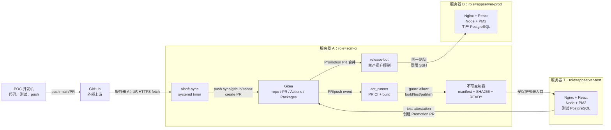
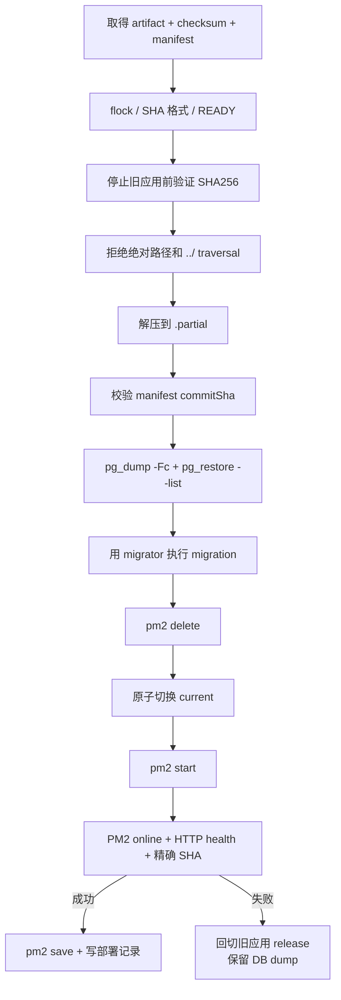

# 12 · Linux / GitHub → Gitea / 三角色职责分离自动部署方案

> 目标方案（2026-07-23；host-role 修订 2026-08-02）｜状态：**设计已确认，尚未在公司服务器实施或验收**
> 适用应用：React SPA 前端 + Node.js 后端 + PostgreSQL + PM2
> 网络约束：POC 开发机不能访问公司内网；安装 Gitea 的 `scm-ci` 服务器可以通过 HTTPS 访问 GitHub。

本册定义一个新的 Linux 应用交付 profile：GitHub 候选进入内网 Gitea，经内网 PR、CI 和
人工审批，在 `scm-ci` 构建一次并发布不可变制品，再由独立 `appserver-test` 部署测试环境，
最后通过 Promotion PR 把同一制品交给 `appserver-prod`。文件名保留早期“双服务器”提案以
维持链接；当前合同至少要求三个隔离 machine identity，不能把测试业务 runtime 与
Gitea/通用 Runner 重新合并。

现有 [01](01-基础设施-VM-Gitea-Runner.md) 和 [02](02-CI与自动部署流水线.md) 记录的是 OrbStack、Next.js、SQLite 试点的 as-built 事实；本册不修改该事实，也不能把 SQLite 脚本改名后直接用于 PostgreSQL。实施本册涉及 CI、制品、数据库迁移、权限、部署和回滚，属于 complex 变更，必须按 `AGENTS.md` 补齐 Issue、spec、plan 和 verification。

---

## 1. 已确认决策

| 决策 | 结论 |
|------|------|
| 外部代码中转 | GitHub |
| 内网正式代码库 | Gitea 普通仓库，不使用持续 Pull Mirror 写入 `main` |
| 同步方向 | 公司 `scm-ci` 服务器主动从 GitHub 拉取 |
| 内网审批事实源 | Gitea PR、Gitea CI 和 Gitea `main` merge |
| GitHub PR/审批 | 仅作为来源信息，不授权内网发布 |
| 测试发布 | 内网 PR 合并后在 `scm-ci` 构建/发布，再由独立 `appserver-test` 部署 |
| 生产发布 | 测试通过后创建独立 Promotion PR；人工合并后自动部署 |
| 制品 | 测试和生产复用完全相同的 tar.gz + manifest + SHA256 |
| React 托管 | Nginx 静态文件；普通 React SPA 不由 PM2 托管 |
| Node 托管 | PM2 单实例 fork 起步 |
| 测试数据库 | 测试 AppServer 上的独立 PostgreSQL 数据库和角色，或独立测试 DB host |
| 生产数据库 | 生产 AppServer/独立 DB host 的 PostgreSQL，不依赖 `scm-ci` |
| 生产运行边界 | 不 `git pull`、不 `npm install`、不现场构建、不运行 AI |
| 主机 Gate | root-owned profile 绑定 hostname+machine-id；固定 action/resource 在 mutation 前 fail closed |

最重要的不变量：

1. POC 和 GitHub 不保存 Gitea token、内网 SSH Key 或生产凭据。
2. 同步机器人只能写 `sync/github/*`，不能写或合并 Gitea `main`。
3. PR 的 `approved` 状态不直接触发部署；只有受保护 `main` 的 merge push 才触发。
4. PR job 不能获得测试部署 Secret 或生产凭据。
5. 生产只能部署已在测试环境通过验收的同一制品 SHA256。
6. 应用可以自动回切旧 release；PostgreSQL restore 必须由人决定。
7. `scm-ci` 永远不能 application deploy/start、创建/使用业务数据库或留下长驻 smoke。
8. profile 无效、权限过宽、未知 capability 或 identity mismatch 时不得进入 mutation。

---

## 2. 目标拓扑



### 2.1 事实源边界

- GitHub `main`：允许进入内网评审的外部候选。
- `sync/github/<github-sha>`：GitHub 某个不可变提交在内网的候选分支。
- Gitea PR：新的内网评审对象，有独立编号、CI、审批和审计记录。
- Gitea `main` merge SHA：构建、测试部署和制品版本的正式源。
- Promotion PR：生产期望状态的正式审批对象。
- 生产健康接口：证明目标机实际运行的 commit，而不是仅证明端口可访问。

Git mirror 只能传输 commits、branches、tags 和 LFS；不能持续保留 GitHub PR 编号、评论、审批身份、CI 状态和内网审计语义。因此每个 GitHub 更新必须在 Gitea 重新创建 PR、重新运行 CI、重新审批。

---

## 3. 服务器职责、端口和目录

### 3.1 服务器 A：`scm-ci`

职责：现有 Gitea/Gitea PostgreSQL、GitHub 入站同步、`act_runner`、React/Node 构建、
Gitea Packages 或受控 `/opt/artifacts`，以及隔离的 production promotion controller。
明确禁止业务 Nginx vhost、PM2/API/worker、持久业务数据库和 job 结束后仍在线的 smoke。

端口：

| 端口 | 服务 | 暴露范围 |
|------|------|----------|
| 443 | `git.company.internal` | 公司内网 |
| 22 | 运维 SSH | 管理网段 |
| 3000 | Gitea upstream | 仅 `127.0.0.1`，由平台 Nginx 代理 |
| 5432 | 仅 Gitea/批准的 CI 数据库 | 仅 `127.0.0.1` |

建议目录：

```text
/var/lib/gitea/
/etc/gitea/
/opt/act-runner/
/var/lib/aisoft-sync/
/etc/aisoft-sync/
/opt/aisoft-sync/
/opt/artifacts/                 # legacy local staging 或批准的受控制品目录
/etc/aisoft/host-profile.json  # root-owned role=scm-ci，无 Secret
```

必须设置：

- Runner `concurrency=1`。
- `gitea-runner` 无 sudo 或只有精确、root-owned 的 build/package/publish 入口。
- Runner 不能读取 `/var/lib/gitea`、`/etc/gitea`、`/etc/aisoft-sync` 和 `release-bot` 的 SSH Key。
- PR job 只能连接每次运行可删除的 CI 数据库，不能连接持久测试/生产库。
- systemd 设置 `CPUQuota`、`MemoryMax`、`TasksMax` 和 job timeout。
- Gitea、Runner workspace、制品、Gitea/CI PostgreSQL 数据和日志分别设置磁盘告警。
- deploy/start/database wrapper 在 mutation 前调用固定 host-role guard；`scm-ci` 的
  application 请求必须退出 20，且 workflow 不得捕获后继续。
- host executor 的 success/failure/cancel 都验证无残留 PID、listener、临时 DB 和 deleted cwd。

host runner 只适用于受信任的公司仓库和成员；如果未来允许不受信任 PR，优先把 Runner
再拆到独立 machine 或切换到更强隔离模式，而不是让其获得 AppServer 权限。

### 3.2 服务器 T：`appserver-test`

测试主机只消费 `scm-ci` 发布、manifest/SHA256/READY 全部匹配的制品。它安装 Nginx、
固定 Node/PM2 和测试 PostgreSQL，拥有独立测试 `.env`、migrator/runtime/backup 角色，
但不运行 Gitea、通用 Runner 或 AI controller。

```text
/opt/ai-platform-test/
├── incoming/
├── releases/<merge-sha>/
├── current -> releases/<merge-sha>
├── shared/
│   ├── uploads/
│   └── logs/
└── state/

/etc/ai-platform/test.env
/etc/ai-platform/test-migrator.env
/etc/aisoft/host-profile.json  # root-owned role=appserver-test
/var/backups/ai-platform-test/
```

应用 deploy/start/stop、migration、business DB use 和 SHA health 各自使用 catalog 中固定
capability；profile 或 identity 校验失败时旧 release 保持不变。首次部署仍须两次幂等、
故意失败和回滚验收。

### 3.3 服务器 B：`appserver-prod`

服务器 B 只安装 Nginx、固定且已验收的 Node/PM2、与测试相同 major 的 PostgreSQL，
以及 root-owned、版本化部署脚本；不安装 Gitea、act_runner、AI controller、源码工作区、
现场构建依赖或 GitHub/Gitea 写凭据。

| 端口 | 服务 | 暴露范围 |
|------|------|----------|
| 443 | 生产 React/API | 业务网段 |
| 22 | 制品上传和固定部署命令 | 服务器 A 的 `release-bot` + 运维管理网段 |
| 3101 | Node API | 仅 `127.0.0.1` |
| 5432 | PostgreSQL | 仅 `127.0.0.1` |
| 80 | 可选 HTTP → HTTPS | 业务网段 |

```text
/opt/ai-platform-prod/
├── incoming/
├── releases/<merge-sha>/
├── current -> releases/<merge-sha>
├── shared/
│   ├── uploads/
│   └── logs/
├── state/
└── deploy/

/etc/ai-platform/prod.env
/etc/ai-platform/prod-migrator.env
/etc/ai-platform/prod-backup.env
/etc/aisoft/host-profile.json  # root-owned role=appserver-prod
/var/backups/ai-platform-prod/
```

生产 PostgreSQL 放服务器 B 可以避免 `scm-ci` 或测试 AppServer 的构建、部署和维护窗口影响
生产，但它不是高可用设计。若 RTO/RPO 要求高于单机能力，需要另增独立数据库/备份节点，
而不是把生产数据库迁回 `scm-ci`。

---

## 4. 身份和最小权限

| 身份 | GitHub | Gitea 代码 | Package | 测试环境 | 生产环境 |
|------|--------|------------|---------|----------|----------|
| POC 开发者 | push/PR | 无网络路径 | 无 | 无 | 无 |
| `aisoft-sync` | 只读 allowlisted ref | push `sync/github/*`、创建 PR | 无 | 无 | 无 |
| `gitea-runner` | 无需写权限 | 读 PR/`main` | 仅上传制品 | 无 application runtime 权限 | 无 |
| `test-deployer` | 无 | 只读 merge SHA/attestation | 只读 | 只能调用 AppServer 固定部署入口 | 无 |
| `ai-test` | 无 | 无 | 只读 | PM2、测试配置、测试 DB runtime | 无 |
| `promotion-bot` | 无 | 只写 deployments 候选分支和 PR | 只读 | 读测试证明 | 无 |
| `release-bot` | 无 | 只读已合并 production manifest | 只读 | 无 | 受限 SSH |
| `deployer` | 无 | 无 | 无 | 无 | 接收制品、调用固定脚本 |
| `ai-prod` | 无 | 无 | 无 | 无 | PM2 runtime |

数据库至少拆分：

- `*_runtime`：应用正常 DML。
- `*_migrator`：schema owner 和 migration。
- `*_backup`：备份读取。

所有 token、SSH Key、数据库连接串和 `.env` 使用 `600` 或必要的 `640` 权限。Secret 不放命令行 URL、不打印到日志、不进入 artifact。

host contract 由 `codex/config/host-role.schema.json`、
`codex/config/host-capabilities.json` 和固定安装入口
`/usr/local/libexec/aisoft/verify-host-role` 定义。live profile 不含 Secret，必须 root-owned、
同时绑定 hostname 与 `/etc/machine-id`。guard 返回 `0=allow`、`20=deny`、
`30=invalid-profile/request`、`40=identity-mismatch`、`64=usage`；部署脚本不能把任何非 0
结果转成 warning 后继续。

---

## 5. 哪些内容随 Git 迁移

### 5.1 通过 GitHub → Gitea 迁移

```text
frontend/
backend/
database/migrations/
scripts/
├── ci/verify.sh
├── release/build-artifact.sh
├── release/publish-artifact.sh
├── deploy/health-check.sh
└── deploy/deploy-contract.md
.gitea/workflows/
├── ci.yml
└── release-test.yml
package-lock.json
ecosystem.config.cjs
docs/
```

应迁移：

- React、Node 源码。
- lock file。
- migration。
- lint、单元测试、集成测试。
- Gitea workflow。
- 确定性构建、制品、健康检查和部署脚本。
- 无 Secret 的 Nginx、PM2、systemd 模板。
- 运维、回滚和验收文档。

### 5.2 必须在公司内网重建

- Runner 注册 token 和 Runner 状态。
- Gitea PAT、SSH Key、Secrets。
- 分支保护、required status、reviewer 和 merge allowlist。
- 内网 DNS、IP、TLS、SMTP。
- PostgreSQL 用户、密码、数据库和实际数据。
- `/etc/ai-platform/*.env`。
- 生产 SSH forced command、防火墙和 sudoers。
- 备份目标、告警、日志轮转和容量策略。
- 缓存、日志、数据库文件和运行状态。

禁止迁移：

- 开发机绝对路径。
- `.env`、PAT、SSH 私钥、Git credentials。
- 本地数据库、缓存、日志。
- POC 构建目录和未验证 artifact。

---

## 6. 网络预检

服务器 A 上线前至少检查：

```bash
git ls-remote https://github.com/<github-org>/<repo>.git refs/heads/main
curl -fsSI https://github.com/
curl -fsSI https://api.github.com/
```

若使用 Git LFS，还要确认 Git LFS 对象域名可达。

构建通常还需要 npm registry。GitHub 可达不等于 npm 可达：

```bash
npm ping --registry=https://registry.npmjs.org/
```

如果公司只允许访问 GitHub，应先建立 Verdaccio 或公司 npm mirror，不能等 CI 运行后再临时放开互联网。

服务器 A → T 只需：

- 制品下载/传输与固定测试部署入口。
- 测试 HTTPS health 和 attestation 回读。
- 公司 DNS/NTP。

服务器 A → B 只需：

- SSH/制品传输。
- 生产 HTTPS 健康检查。
- 公司 DNS/NTP。

服务器 T/B 默认都不需要访问 GitHub 或公共 npm registry。

---

## 7. Gitea 仓库一次性初始化

空 Gitea 仓库没有可供 PR 合并的共同基线，因此第一次由管理员执行受控 bootstrap：

1. 在 Gitea 创建普通仓库，不启用持续 Pull Mirror。
2. 从 GitHub 导入当前 `main`。
3. 验证两边 `main` SHA：

```bash
git ls-remote https://github.com/<github-org>/<repo>.git refs/heads/main
git ls-remote ssh://git@git.company.internal/<gitea-org>/<repo>.git refs/heads/main
```

4. 两个 SHA 必须一致。
5. 立即创建 `main` 分支保护。
6. bootstrap 账号撤销 `main` push 权限。
7. 后续一律走 `sync/github/<sha>` → Gitea PR。

### 7.1 `main` 分支保护

建议配置：

- 禁止直接 push。
- 禁止 force push。
- 至少 1 名内部审批人；生产 Promotion PR 建议 2 名。
- 新提交使旧审批失效。
- rejected review 未解决时禁止合并。
- PR 落后于 `main` 时禁止合并。
- 必须通过实际读回的 CI context，例如当前平台口径 `CI / test (pull_request)`。
- merge allowlist 只包含内部 Maintainer。
- 管理员也必须遵守保护规则。
- `aisoft-sync` 不在 push/merge allowlist。
- 推荐只允许 merge commit，保留 GitHub 原始提交的 ancestry。

required context 名必须先让 workflow 真实运行一次，再从 Gitea 的 status check 列表选取；不要凭文档猜测字符串。

---

## 8. GitHub 入站同步

### 8.1 配置

服务器 A：

```bash
# /etc/aisoft-sync/ai-platform.env
GITHUB_URL=https://github.com/<github-org>/<repo>.git
GITHUB_REF=refs/heads/main

GITEA_URL=https://git.company.internal
GITEA_OWNER=<gitea-org>
GITEA_REPO=<repo>
GITEA_SSH_URL=git@git.company.internal:<gitea-org>/<repo>.git

GITEA_TOKEN_FILE=/etc/aisoft-sync/keys/gitea-token
GITEA_SSH_KEY_FILE=/etc/aisoft-sync/keys/gitea-sync
GITEA_KNOWN_HOSTS_FILE=/etc/aisoft-sync/known_hosts
```

私有 GitHub 仓库使用 repo-scoped、只读 Deploy Key 或 fine-grained token。Gitea bot 需要：

- 对目标仓库的 Write 权限，用于 `sync/github/*`。
- PR 创建权限。
- 不在 `main` push 或 merge allowlist。

### 8.2 `reconcile` 算法

`inbound-sync.sh reconcile ai-platform` 必须：

1. `set -Eeuo pipefail`，禁用 Secret 输出。
2. 使用 `flock`，同一 profile 只能有一个同步进程。
3. 只 fetch allowlisted `refs/heads/main`。
4. 解析并验证完整 40 位 commit SHA。
5. 记录 `last-seen-sha`。
6. 如果上次 SHA 不是新 SHA 的 ancestor，按 GitHub history rewrite 处理：fail closed、告警、等待人工。
7. 检查 GitHub SHA 与 Gitea `main` 有共同历史。
8. 如果 SHA 已在 Gitea `main` ancestry 中，幂等成功。
9. 生成不可变分支 `sync/github/<full-sha>`。
10. 同名远端分支若指向其他 SHA，立即失败，禁止 force-push。
11. 查询是否已有同 SHA 的 open PR；存在则幂等成功。
12. 每项目最多一个活跃 sync PR；GitHub 后续 SHA 记录为 pending，不修改正在审批的分支。
13. 推送 sync 分支。
14. 调用 Gitea REST 创建 PR。

唯一允许的 push 形态：

```bash
git push gitea \
  "<github-sha>:refs/heads/sync/github/<github-sha>"
```

同步实现中不得出现：

```text
refs/heads/main
git push --mirror
git push --force
PR merge API
```

创建 PR：

```http
POST /api/v1/repos/<owner>/<repo>/pulls
Content-Type: application/json

{
  "base": "main",
  "head": "sync/github/<github-sha>",
  "title": "sync: import GitHub <short-sha>",
  "body": "GitHub URL、source ref、完整 SHA、compare range、同步时间"
}
```

PR 正文必须明确：

> This is a new intranet PR. GitHub review is provenance only and does not authorize an intranet release.

### 8.3 systemd

```ini
# /etc/systemd/system/aisoft-inbound-sync@.service
[Unit]
Description=AISoft GitHub inbound sync for %i
After=network-online.target
Wants=network-online.target

[Service]
Type=oneshot
User=aisoft-sync
Group=aisoft-sync
ExecStart=/opt/aisoft-sync/inbound-sync.sh reconcile %i
NoNewPrivileges=true
PrivateTmp=true
ProtectSystem=strict
ProtectHome=true
ReadOnlyPaths=/etc/aisoft-sync
ReadWritePaths=/var/lib/aisoft-sync
```

```ini
# /etc/systemd/system/aisoft-inbound-sync@.timer
[Unit]
Description=Poll GitHub for %i

[Timer]
OnBootSec=2min
OnUnitActiveSec=5min
RandomizedDelaySec=30s
Unit=aisoft-inbound-sync@%i.service

[Install]
WantedBy=timers.target
```

启用和观察：

```bash
sudo systemctl daemon-reload
sudo systemctl enable --now aisoft-inbound-sync@ai-platform.timer
systemctl list-timers 'aisoft-inbound-sync*'
journalctl -u aisoft-inbound-sync@ai-platform.service
```

---

## 9. PR CI

PR workflow 只做验证，不持有部署凭据：

```text
pull_request(main)
→ npm ci
→ lint
→ disposable PostgreSQL migrate
→ unit/integration tests
→ React build
→ Node build
```

建议把复杂逻辑放在版本化脚本中，workflow 只调用稳定入口：

```yaml
# .gitea/workflows/ci.yml
name: CI

on:
  pull_request:
    branches: [main]

jobs:
  test:
    runs-on: linux-build
    steps:
      - uses: actions/checkout@v4
        with:
          fetch-depth: 0
      - run: ./scripts/ci/verify.sh
```

注意：

- `actions/checkout` 应镜像到内网 Gitea并 pin 到已审核版本，避免 CI 长期依赖 GitHub 在线状态。
- PR CI 不能注入 Package 写 token、持久测试 DB 连接串、测试部署 Key 或生产 Secret。
- CI PostgreSQL 每个 run 使用唯一数据库名，结束后删除。
- 测试 migration 必须从空库执行成功。
- `npm ci` 必须以 lock file 为准，不允许 CI 修改依赖锁。
- React 和 Node build 都必须输出可验证的产物。

---

## 10. 合并后构建和测试部署

只有 Gitea `main` push 触发：

```text
push(main)
→ checkout 精确 merge SHA
→ 重新 verify
→ build 一次
→ pack
→ SHA256
→ publish immutable Package
→ 调用服务器 T 的固定部署入口
→ T 上验证 role=appserver-test
→ deploy test
→ PM2 + HTTP + commit SHA 验证
→ test attestation
→ 创建 production Promotion PR
```

不得监听：

- GitHub webhook。
- Gitea PR approval event。
- `approved` label。
- 任意 sync 分支 push。

部署事实源必须是 `main` merge SHA，而不是 GitHub SHA；artifact manifest 同时记录两者。
服务器 A 只发布制品和部署请求，不读取测试 `.env` 或直接操作 PM2/业务 DB。服务器 T 在
任何 deploy/migration/start 前验证固定 host-role profile；非 0 退出时旧 release 不变。

---

## 11. 不可变制品合同

Gitea Package version 固定为 Gitea `main` merge SHA：

```text
ai-platform-<merge-sha>.tar.gz
ai-platform-<merge-sha>.tar.gz.sha256
manifest.json
READY.json
test-attestation.json
```

`READY.json` 最后上传。下载端拒绝：

- 没有 `READY.json` 的半成品。
- SHA256 不匹配。
- manifest SHA 与请求 SHA 不一致。
- 同一个 Package version 出现不同字节。
- 生产所需 `test-attestation.json` 缺失或不匹配。

retention 不得按文件名或 mtime 直接删除。每个项目先进入显式 allowlist，解析完整 SHA，
重新计算 checksum，并保护 current/test attestation/production manifest/rollback window 中的
引用；随后才按最低保留数量与期限生成 dry-run audit ledger。未知项目、非 SHA 名称、缺少
checksum、引用不完整或共享引用一律 `BLOCKED`。apply/delete 是 ledger 之外的独立人工 Gate。

tar.gz：

```text
frontend/                     # React dist 内容
backend/
├── dist/
├── node_modules/             # production dependencies
├── package.json
└── package-lock.json
database/migrations/
ecosystem.config.cjs
manifest.json
```

不得包含：

- `.env`。
- 日志、缓存、数据库。
- SSH Key、PAT、证书私钥。
- 整个源码 workspace。
- 测试报告中的敏感数据。

示例 manifest：

```json
{
  "application": "ai-platform",
  "commitSha": "<gitea-main-merge-sha>",
  "githubSourceSha": "<github-source-sha>",
  "nodeVersion": "<pinned-node-version>",
  "platform": "linux-x64",
  "deploymentContractVersion": 1
}
```

构建机与生产机必须保持：

- 相同 CPU 架构。
- 相同 Node major。
- 兼容的 Linux/glibc。
- 相同 PostgreSQL major。

存在原生 Node addon 时，应在与生产完全匹配的 Linux 环境中构建 production `node_modules`。生产机不得重新执行 `npm install`。

---

## 12. React / Nginx

本册假设前端是普通 React SPA。若实际是 Next.js SSR，需要建立独立 profile，不能套用静态托管配置。

React API 地址使用同源相对路径 `/api`，不要在 bundle 中写死测试或生产域名。这样测试和生产才能使用同一前端字节。

```nginx
server {
    listen 443 ssl;
    server_name app.company.internal;

    root /opt/ai-platform-prod/current/frontend;

    location / {
        try_files $uri $uri/ /index.html;
    }

    location = /index.html {
        add_header Cache-Control "no-store";
    }

    location /assets/ {
        expires 1y;
        add_header Cache-Control "public, immutable";
    }

    location /api/ {
        proxy_pass http://127.0.0.1:3101;
        proxy_http_version 1.1;
        proxy_set_header Host $host;
        proxy_set_header X-Real-IP $remote_addr;
        proxy_set_header X-Forwarded-For $proxy_add_x_forwarded_for;
        proxy_set_header X-Forwarded-Proto $scheme;
    }
}
```

每次修改：

```bash
sudo nginx -t
sudo systemctl reload nginx
```

Nginx 只需要读取 release 的 `frontend/`；不要通过加入应用 Secret group 的方式授予权限。部署脚本应单独设置 frontend 目录的 group/read 权限。

---

## 13. Node / PM2

Node 版本策略：

- 先读取应用当前支持范围。
- 选择仍受支持的 LTS。
- 测试和生产 pin 到同一 exact version。
- 不在首次内网迁移中同时做未经验证的 Node major 升级。
- 现有试点文档中的 Node 20 是历史 as-built，不自动成为本 profile 的新生产基线。

PM2 起步配置：

```javascript
// ecosystem.config.cjs
module.exports = {
  apps: [{
    name: "ai-platform-api",
    cwd: "/opt/ai-platform-prod/current/backend",
    script: "/usr/local/libexec/ai-platform-start-api",
    interpreter: "/bin/bash",
    instances: 1,
    exec_mode: "fork",
    watch: false,
    autorestart: true,
    max_memory_restart: "768M",
    kill_timeout: 10000,
    out_file: "/opt/ai-platform-prod/shared/logs/api-out.log",
    error_file: "/opt/ai-platform-prod/shared/logs/api-error.log",
    env_production: {
      NODE_ENV: "production",
      PORT: "3101"
    }
  }]
};
```

数据库连接串等 Secret 不写入 ecosystem。使用固定、root-owned wrapper：

```bash
#!/usr/bin/env bash
set -Eeuo pipefail
set -a
source /etc/ai-platform/prod.env
set +a
exec /usr/bin/node /opt/ai-platform-prod/current/backend/dist/server.js
```

部署统一使用：

```text
pm2 delete ai-platform-api
→ 原子切换 current
→ pm2 start current/ecosystem.config.cjs --env production
→ 断言 PM2 online
→ 验证 health 精确 SHA
→ pm2 save
```

当前平台已出现过 `pm2 reload` 继续使用旧 release 的 resolved cwd/script 的实证故障，因此本 profile 在完成独立零停机验收前不使用 reload。单实例起步会产生数秒 API 停机；若业务要求零停机，后续采用两个端口的蓝绿切换，而不是放松 release/SHA 验证。

---

## 14. PostgreSQL

### 14.1 数据库布局

服务器 A（`scm-ci`）：

```text
gitea                  # 现有 Gitea DB/role
ci_<run-id>            # 每个 PR 可删除的临时 DB
```

服务器 T（`appserver-test`）：

```text
ai_platform_test       # 持久测试环境
```

服务器 B（`appserver-prod`）：

```text
ai_platform_prod
```

Gitea DB、一次性 CI DB、测试应用 DB 和生产应用 DB 分属上述 trust zone 与角色；不得为了
节省一个 PostgreSQL instance 把持久业务 DB 放回 `scm-ci`。

### 14.2 角色

以生产为例：

```sql
CREATE ROLE ai_prod_migrator LOGIN;
CREATE ROLE ai_prod_runtime LOGIN;
CREATE ROLE ai_prod_backup LOGIN;

CREATE DATABASE ai_platform_prod OWNER ai_prod_migrator;
```

连接 `ai_platform_prod` 后：

```sql
REVOKE CREATE ON SCHEMA public FROM PUBLIC;
GRANT USAGE ON SCHEMA public TO ai_prod_runtime;

GRANT SELECT, INSERT, UPDATE, DELETE
ON ALL TABLES IN SCHEMA public TO ai_prod_runtime;

GRANT USAGE, SELECT, UPDATE
ON ALL SEQUENCES IN SCHEMA public TO ai_prod_runtime;

ALTER DEFAULT PRIVILEGES FOR ROLE ai_prod_migrator
IN SCHEMA public
GRANT SELECT, INSERT, UPDATE, DELETE ON TABLES TO ai_prod_runtime;

ALTER DEFAULT PRIVILEGES FOR ROLE ai_prod_migrator
IN SCHEMA public
GRANT USAGE, SELECT, UPDATE ON SEQUENCES TO ai_prod_runtime;

GRANT pg_read_all_data TO ai_prod_backup;
```

密码使用 `psql \password`、企业 Secret 管理器或不会进入 shell history 的受控 provision 流程设置。

### 14.3 网络认证

生产 API 和 PostgreSQL 同机：

```conf
listen_addresses = '127.0.0.1'
password_encryption = 'scram-sha-256'
```

`pg_hba.conf` 的具体规则放在宽泛规则之前：

```conf
host ai_platform_prod ai_prod_runtime  127.0.0.1/32 scram-sha-256
host ai_platform_prod ai_prod_migrator 127.0.0.1/32 scram-sha-256
host ai_platform_prod ai_prod_backup   127.0.0.1/32 scram-sha-256
```

检查：

```sql
SELECT * FROM pg_hba_file_rules WHERE error IS NOT NULL;
```

确认无错误后 reload PostgreSQL，不需要向内网开放 `5432`。

---

## 15. 目标机部署状态机

测试和生产使用同一个 `deploy-release <environment> <sha>` 合同；差异只在路径、Secret、数据库和审批来源。



详细顺序：

1. 校验 environment 和完整 40 位 SHA。
2. `flock` 防止并发部署。
3. 如果该 SHA 已运行且真实健康，幂等 no-op。
4. 下载 tar、`.sha256`、manifest、`READY.json`。
5. 在停止应用前执行 `sha256sum -c`。
6. 列出 tar 内容，拒绝绝对路径、`..` 和预期外文件。
7. 解压到 `releases/.<sha>.partial`。
8. 校验 manifest。
9. 原子重命名为 `releases/<sha>`。
10. 记录 previous release 和 previous SHA。
11. 迁移前 PostgreSQL 备份：

```bash
pg_dump --format=custom \
  --no-owner \
  --no-privileges \
  --file="/var/backups/ai-platform-prod/pre-<sha>.dump.tmp" \
  "$BACKUP_DATABASE_URL"

pg_restore --list \
  "/var/backups/ai-platform-prod/pre-<sha>.dump.tmp"
```

12. dump 成功后原子重命名并生成 SHA256。
13. 使用 migrator Secret 执行项目确定的 production migration：

```bash
npm run db:migrate:deploy
```

14. `pm2 delete ai-platform-api`。
15. 创建临时 symlink，再用原子 rename 切换 `current`。
16. 启动 PM2。
17. 断言进程唯一且 `online`。
18. 健康检查必须验证：

```json
{
  "status": "ok",
  "database": "ok",
  "commitSha": "<expected-merge-sha>"
}
```

19. 成功后执行 `pm2 save` 并写部署记录。
20. 失败时删除新进程、回切 previous、重新启动并验证旧 SHA。
21. PostgreSQL 不自动 restore；输出 dump 路径并升级给人。

应用 migration 必须使用 expand/contract：

- 第一次发布先增加兼容结构。
- 新旧应用同时兼容。
- 完成切换并稳定后，另一个 PR 再删除旧结构。

否则 migration 已成功但应用健康失败时，旧 release 可能无法使用新 schema。

---

## 16. 生产 Promotion PR

生产发布不应直接继承代码 PR 的审批。建议创建内网仓库：

```text
<gitea-org>/ai-platform-deployments
```

生产期望状态：

```yaml
application: ai-platform
environment: production
artifact:
  version: "<gitea-main-merge-sha>"
  sha256: "<artifact-sha256>"
source:
  github_sha: "<github-source-sha>"
  gitea_pr: 123
test:
  status: passed
  health_commit_sha: "<gitea-main-merge-sha>"
  attestation: "<package-path-or-id>"
```

测试成功后：

1. `promotion-bot` 创建 `promote/production/<sha>`。
2. 更新 manifest。
3. 创建 Promotion PR。
4. Release Manager 核对测试证明、变更窗口和回滚条件。
5. 至少达到 required approvals。
6. 人工 merge。
7. 独立 `release-bot` 读取 deployments `main`。
8. 下载同一 artifact 和 test attestation。
9. 验证 artifact SHA256。
10. 传输服务器 B。
11. 调用固定部署命令。
12. 将结果回写到 PR 评论、Issue 或部署审计记录。

`release-bot` 不运行普通 PR workflow。生产 SSH Key 不能放在 `/opt/act-runner`、Gitea workflow Secret 或普通 Runner workspace。

### 16.1 受限 SSH

服务器 B 的 `authorized_keys`：

```text
command="/opt/ai-platform-prod/deploy/forced-command",no-port-forwarding,no-agent-forwarding,no-X11-forwarding,no-pty ssh-ed25519 ...
```

只允许：

```text
upload <40-sha> artifact
upload <40-sha> checksum
deploy <40-sha>
status <40-sha>
```

目标路径由服务器 B 根据 SHA 推导。调用方不能传任意文件路径、shell、PM2 命令或数据库命令。

---

## 17. 备份、监控和日志

### 17.1 备份

服务器 A：

- Gitea PostgreSQL。
- repositories、LFS、attachments、Packages。
- `/etc/gitea/app.ini` 和实例密钥。

服务器 T：

- 每次测试 migration 前 `pg_dump -Fc`。
- 测试 uploads/config 和 restore drill 证据。

服务器 B：

- 每次 migration 前 `pg_dump -Fc`。
- 每日数据库备份。
- RPO 小于 24 小时时增加 WAL/PITR。
- `/etc/ai-platform` 的 Secret 通过公司批准方式备份。
- Nginx/PM2/部署脚本配置。

备份必须：

- 加密。
- 保存到 A/T/B 之外的 NAS 或企业备份系统。
- 定义保留期。
- 定期在隔离数据库真实 restore。

`pg_dump` 成功和 `pg_restore --list` 只证明 dump 可读取，不等于完整恢复验收。

### 17.2 监控

至少监控：

- Gitea、PostgreSQL、Nginx systemd 状态。
- Runner online 和 queue。
- GitHub sync timer 最后成功时间。
- PM2 process status、restart count 和 memory。
- `/api/health` 的 HTTP、database 和 commit SHA。
- 证书到期。
- 磁盘 inode/容量。
- 最近备份时间、大小和 restore drill 记录。
- 系统时钟/NTP。

初始告警建议：

- 磁盘超过 80%。
- 最近成功备份超过 26 小时。
- sync 连续失败 3 次。
- Runner 离线 5 分钟。
- PM2 短时间连续重启。
- health 连续失败。
- 实际运行 SHA 与 production manifest 不一致。

使用 `pm2-logrotate`、journald、Nginx 和 PostgreSQL 日志轮转。日志不得打印连接串、token 或用户敏感数据。

---

## 18. 分阶段实施

### Phase 0：参数和兼容性

- [ ] 确认 A/T/B 三个隔离 identity 的 OS、CPU、磁盘、内存。
- [ ] 确认 React 是 SPA，不是 SSR。
- [ ] 确认 Node 当前版本和受支持 LTS 目标。
- [ ] 确认 PostgreSQL major。
- [ ] 确认项目 migration 命令。
- [ ] 确认 GitHub 私有/公开、是否使用 LFS/Submodule。
- [ ] 确认 npm registry 可达或建立内网 mirror。
- [ ] 确认内网 DNS、TLS、SMTP、备份目标。
- [ ] 定义生产 RTO/RPO 和维护窗口。

### Phase 1：服务器基础

- [ ] 创建 OS service accounts。
- [ ] 建立目录和权限。
- [ ] 为 `scm-ci`、`appserver-test`、`appserver-prod` 安装并验证 root-owned host profile/guard。
- [ ] 安装并 pin Node/PM2/Nginx/PostgreSQL。
- [ ] 建测试/生产 DB 和角色。
- [ ] 配置 loopback、防火墙、TLS、NTP。
- [ ] 配置 PM2 startup、日志轮转和基础监控。

### Phase 2：Gitea bootstrap 和同步

- [ ] 一次性导入 GitHub `main` 基线。
- [ ] 验证两边 SHA。
- [ ] 配置 `main` 分支保护。
- [ ] 创建 `aisoft-sync` 和最小权限 token/key。
- [ ] 安装 sync script/service/timer。
- [ ] 验证同 SHA 幂等、force-push fail closed、bot 不能写 `main`。

### Phase 3：CI 和制品

- [ ] 建 PR CI。
- [ ] 建 disposable PostgreSQL 测试。
- [ ] 建 build/pack/publish。
- [ ] 制品包含 manifest/SHA256/READY。
- [ ] Package 不可覆盖。
- [ ] workflow/action 依赖镜像到内网。

### Phase 4：测试部署

- [ ] 在服务器 T 建 role=`appserver-test`，证明 A 上 application start 固定拒绝。
- [ ] 建 `/opt/ai-platform-test`。
- [ ] 建测试 Nginx/PM2/.env。
- [ ] 建 PostgreSQL migration 和 pre-migration backup。
- [ ] 合并 `main` 自动部署。
- [ ] 验证 exact commit health。
- [ ] 生成 test attestation。

### Phase 5：生产提升

- [ ] 建 deployments repo 和 Promotion PR。
- [ ] 建 `release-bot`。
- [ ] 建服务器 B forced command。
- [ ] 首次部署。
- [ ] 重复部署幂等。
- [ ] 故意制造 migration/start/health 失败。
- [ ] 验证应用回切和 DB 人工恢复边界。

### Phase 6：运维验收

- [ ] A/T/B 三个角色重启恢复。
- [ ] 备份 restore drill。
- [ ] 告警演练。
- [ ] 凭据轮换。
- [ ] 清点 Package/release/backup 保留策略。
- [ ] 完成 `03-verification.md`。

---

## 19. 最小验收矩阵

| 场景 | 期望 |
|------|------|
| POC 访问内网 | 无路径、无凭据 |
| sync-bot push `main` | Gitea 拒绝 |
| 相同 GitHub SHA 连续 reconcile | 一个分支、一个 PR |
| GitHub history rewrite | 同步停止并告警 |
| PR CI 失败 | 不能 merge |
| PR 只有 approve、未 merge | 不部署 |
| Gitea `main` merge | 构建一个新 Package 并自动部署测试 |
| 同 SHA 重复部署测试 | 健康 no-op |
| tar 被修改 | 旧应用不停止 |
| migration 失败 | 新版不启动；保留 dump；旧版恢复 |
| 新版 health 返回错误 SHA | 判定失败并回切 |
| Promotion PR 未 merge | 生产不变 |
| 生产部署 | artifact SHA256 与测试证明完全相同 |
| 生产重复部署同 SHA | 健康 no-op |
| 服务器重启 | Nginx/PostgreSQL/PM2/timers 恢复 |
| 备份恢复 | 隔离环境 restore 成功并有记录 |

---

## 20. 实施前仍需填入的环境参数

本方案不依赖以下参数的具体值，但生成正式脚本和 inventory 前必须确认：

```text
SERVER_A_HOST / IP
SERVER_T_HOST / IP
SERVER_B_HOST / IP
SERVER_A_MACHINE_ID / SERVER_T_MACHINE_ID / SERVER_B_MACHINE_ID
GITEA_URL
GITHUB_URL
GITEA_OWNER / REPO
TEST_FQDN
PRODUCTION_FQDN
LINUX_DISTRIBUTION / VERSION / ARCH
NODE_VERSION
PM2_VERSION
POSTGRESQL_MAJOR
APP_NAME
NODE_ENTRYPOINT
DATABASE_MIGRATION_COMMAND
HEALTH_PATH
BACKUP_TARGET
RTO / RPO
```

任何实施结果只能在真实服务器运行相应命令并记录证据后标为通过；本文档本身不证明 Gitea 同步、CI、测试部署或生产部署已经上线。

---

## 21. 参考

项目内：

- [01 · 基础设施：VM / Gitea / Runner / Verdaccio / Mailpit](01-基础设施-VM-Gitea-Runner.md)
- [02 · CI 与自动部署流水线](02-CI与自动部署流水线.md)
- [06 · 运维手册与踩坑集](06-运维手册与踩坑集.md)
- [07 · 内网与生产平移路线](07-内网与生产平移路线.md)

官方文档：

- [Gitea Protected Branches](https://docs.gitea.com/zh-cn/usage/access-control/protected-branches)
- [Gitea Actions / act_runner](https://docs.gitea.com/next/usage/actions/act-runner)
- [Gitea Generic Package Registry](https://docs.gitea.com/1.24/usage/packages/generic)
- [npm ci](https://docs.npmjs.com/cli/commands/npm-ci/)
- [Node.js Release Schedule](https://nodejs.org/en/about/previous-releases)
- [PM2 Application Declaration](https://pm2.keymetrics.io/docs/usage/application-declaration/)
- [PM2 Startup Hook](https://pm2.keymetrics.io/docs/usage/startup/)
- [Nginx Proxy Module](https://nginx.org/en/docs/http/ngx_http_proxy_module.html)
- [PostgreSQL pg_hba.conf](https://www.postgresql.org/docs/current/auth-pg-hba-conf.html)
- [PostgreSQL pg_dump](https://www.postgresql.org/docs/current/app-pgdump.html)
