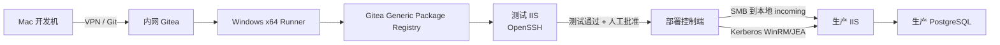
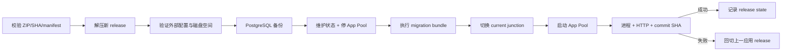

# 12 · Windows 平台自动部署方案

> 状态：设计已确认，尚未实施和验收。本文定义 Windows 项目的目标架构与不可变合同，不把 Linux/rsdesign-new 试点细节当作默认值。

## 1. 目标与适用范围

适用于以下应用：

- 后端：C# / ASP.NET Core。
- 前端：React，构建结果写入 ASP.NET Core `wwwroot`。
- Web：IIS + ASP.NET Core Module。
- 数据库：PostgreSQL Windows 版本。
- 目标系统：Windows Server 2019+ x64；正式非生产测试基线使用 Windows Server 2022 x64。Mac 可先用 Windows 11 ARM 快速调试脚本，但不计入正式 x64 验收。
- 发布方式：单一 `win-x64` ZIP 制品，允许短暂计划停机。

目标是让同一套版本化源码和脚本在本地测试原型、公司测试环境和公司生产环境中复用。环境差异只通过外部配置、Secret、身份和地址表达。

## 2. 已确认决策

| 主题 | 决策 |
|---|---|
| 本地开发 | Mac 继续作为开发电脑，本地 Gitea 承载原型阶段 |
| 正式代码源 | 迁移后公司内网 Gitea 是唯一正式权威源 |
| GitHub | 只镜像本地 Gitea，与公司 Gitea 无关系 |
| 构建 | 正式制品由公司 Windows x64 Runner 构建 |
| 测试部署 | OpenSSH：SCP/SFTP 传输 + SSH 执行固定 PowerShell |
| 生产部署 | SMB 传输 + Kerberos WinRM + JEA 限权执行 |
| Web/DB | 生产分机；小型非生产环境可同机 |
| 停机 | 允许计划停机完成备份、migration、切换和启动 |
| AI | 只参与开发/测试设计与排障；生产 script-only |
| 快速原型 | Fusion + Windows 11 ARM 只验证架构无关脚本；正式 x64/AD Gate 不变 |

## 3. 目标拓扑与信任边界



角色隔离：

| 角色 | 允许 | 禁止 |
|---|---|---|
| Mac | 开发、测试、push、PR、非生产排障 | 保存生产 Secret、生成最终生产制品 |
| Gitea | 代码、PR、workflow、制品、审计 | 运行生产应用 |
| Windows Runner | 编译、测试、打包、上传制品 | 成为生产管理员 |
| 测试 IIS | 验证真实部署脚本 | 作为正式构建机 |
| 部署控制端 | 下载批准制品、SMB 传输、调用 JEA | 任意修改应用代码 |
| 生产 IIS | 运行已验证制品 | Git pull、安装 SDK/Node/AI、现场编译 |
| 生产 PostgreSQL | 数据持久化、备份和恢复 | 与普通构建任务共享高权限账号 |

## 4. Change ID

Gitea 原生 `#N` 保留用于仓库内部关联；平台使用短 Change ID 串联文档、分支、制品和部署记录：

```text
原型：<项目三字符代码>-NNNN，例如 RSD-0008
正式：PRD-NNNN，例如 PRD-0001
```

正式项目示例：

```text
Issue title: [PRD-0001] 建设 Windows 正式部署链
Branch:      change/PRD-0001
Docs:        docs/changes/PRD-0001/
PR:          Change-ID: PRD-0001 / Closes #1
Artifact:    MyApp-PRD-0001-<sha>-win-x64.zip
```

Change ID 每个项目仓库独立递增，不按年份重置，不复用。跨仓库展示时增加仓库上下文，例如 `myapp@PRD-0001`，仓库内部仍使用短编号。

## 5. 源码与构建布局

推荐仓库形态：

```text
src/
├── MyApp.Api/                 # ASP.NET Core
├── MyApp.Application/
├── MyApp.Infrastructure/
└── MyApp.Web/                 # React
tests/
deploy/
├── modules/AISoft.Deployment/
├── test/Invoke-TestDeploy.ps1
├── prod/Invoke-ProdDeploy.ps1
└── health/Test-ApplicationHealth.ps1
.gitea/workflows/
├── ci.yml
└── build-deploy-test.yml
```

构建顺序：

```text
npm ci
→ React test/build
→ 将静态文件写入 ASP.NET Core wwwroot
→ dotnet restore（使用 lock file）
→ dotnet test
→ 空 PostgreSQL 验证 migration
→ dotnet publish -r win-x64
→ 生成 migration bundle
→ manifest + ZIP + SHA256
```

实际项目必须锁定 .NET、Node、npm、PostgreSQL 客户端和 Gitea Runner 版本。版本升级与应用发布分开实施。

## 6. 不可变制品合同

```text
MyApp-PRD-0001-<commit-sha>-win-x64.zip
├── app/
│   ├── MyApp.exe
│   ├── web.config
│   ├── wwwroot/
│   └── *.dll
├── migrations/
│   └── MyApp.Migrations.exe
└── manifest.json

MyApp-PRD-0001-<commit-sha>-win-x64.sha256
```

`manifest.json` 至少包含：

```json
{
  "application": "MyApp",
  "changeId": "PRD-0001",
  "version": "1.0.0",
  "commitSha": "FULL_SHA",
  "runtimeIdentifier": "win-x64",
  "databaseMigration": "MIGRATION_ID",
  "deploymentContractVersion": "1"
}
```

守门规则：

- commit SHA 必须是完整 SHA。
- ZIP 的最终 SHA256 记录在相邻 `.sha256` 文件和 Package/部署记录中，避免 manifest 自包含哈希产生循环依赖。
- 同一 package version 不允许覆盖。
- React 与 ASP.NET Core 必须在同一 ZIP 中交付。
- 测试和生产使用相同 ZIP 和 SHA256，不得重新构建。
- ZIP 不包含 `.env`、数据库密码、证书私钥、Gitea token 或生产地址。

## 7. 配置与运行时状态

React 优先使用同源 `/api`。确需环境差异时，由 ASP.NET Core 提供运行时配置 endpoint，不能通过重新构建 React 切换环境。

目标目录：

```text
C:\Apps\MyApp\
├── incoming\
├── releases\<commit-sha>\
├── current\                    # junction
├── shared\config\
├── shared\data-protection\
├── shared\logs\
├── backups\
└── state\
```

要求：

- `releases` 只读保存版本化应用。
- `current` 指向当前 release。
- 配置、ASP.NET Core Data Protection keys、日志和备份位于 release 外。
- IIS App Pool identity 只读 `current`，只写必要的 shared 目录。
- 健康接口返回应用状态、版本和完整或可唯一定位的 commit SHA，不返回 Secret。

## 8. 测试环境：OpenSSH

测试部署身份使用独立 key，不使用个人管理员账号。防火墙只允许 Runner 或指定部署机访问 OpenSSH。

```text
Runner
→ 下载/读取本次制品
→ SCP ZIP、SHA256 到 C:\Apps\MyApp\incoming
→ SSH 调用固定入口 Install-AISoftRelease.ps1
→ 读取结构化部署结果
→ HTTP health + commit SHA 校验
```

SSH 只是传输和远程执行通道；真正的部署逻辑必须位于版本化 PowerShell module 中，不能散落在 workflow 的临时命令里。

## 9. 生产环境：SMB + Kerberos WinRM + JEA

生产部署分两步：

1. 部署控制端通过 SMB 把已批准 ZIP 和 SHA256 写入生产服务器本地 `incoming`。
2. 部署控制端使用 FQDN，通过 Kerberos WinRM 连接专用 JEA Endpoint，调用固定命令处理本地文件。

先落本地再调用 JEA，避免 WinRM 会话再次访问远程 SMB 时产生 second-hop 依赖。

建议 AD 组与 Endpoint：

```text
AD group: DOMAIN\GG-MyApp-Deployers
JEA endpoint: MyApp.Deployment
```

JEA 只暴露：

```powershell
Get-AISoftReleaseStatus
Install-AISoftRelease
Test-AISoftHealth
Restore-AISoftRelease
```

禁止通用 PowerShell、`cmd.exe`、任意服务管理、任意路径写入和交互式本地管理员能力。JEA 配置、Role Capability、PowerShell module 和 transcript 路径都必须版本化并单独验收。

## 10. 部署状态机



所有步骤必须 fail-closed：校验、备份或 migration 失败时不切换应用；启动或健康失败时停止继续发布并回切应用版本。

## 11. PostgreSQL 合同

生产最少分离：

| 身份 | 权限 |
|---|---|
| `myapp_runtime` | 运行期最小 DML 权限 |
| `myapp_migrator` | 受控 schema migration 权限 |
| `myapp_backup` | 执行备份所需的只读权限 |

规则：

- 生产连接启用 TLS，并限制 Web/部署控制端来源地址。
- migration 使用 bundle 或审查过的 SQL，不在应用启动时自动迁移。
- migration 采用 expand/contract，至少在同一发布窗口允许新旧应用兼容。
- 每次 migration 前生成可恢复备份，并在测试环境真实演练恢复。
- 普通应用健康失败只自动回滚应用；数据库恢复必须按预案人工确认，不能自动覆盖生产数据。

## 12. 监控、审计与备份

每次发布至少记录：

```text
application
change_id
commit_sha
artifact_sha256
operator/service_identity
start_time/end_time
source_environment
target_environment
database_backup_id
migration_result
health_result
rollback_result
```

JEA transcript、Windows Event Log、IIS 日志、应用结构化日志和 Gitea Actions 日志需要统一时间源。Gitea 数据库、repositories、attachments/LFS、Packages、配置和制品都必须纳入公司备份，并定期完成恢复演练。

## 13. 非目标与实施边界

本文不授权：

- 修改现有 Linux 试点脚本。
- 在生产安装 AI 或允许 AI 直接执行生产命令。
- 在通用 Runner 中保存生产管理员凭据。
- 自动合并 PR 或自动晋级生产。
- 在未验证备份时执行破坏性 PostgreSQL migration。
- 把 Windows 目标描述为已经建成。

具体迁移步骤见 [13](13-项目结果迁移与内网切换实施手册.md)，验证证据见 [14](14-Windows部署与迁移验收清单.md)，Mac 快速原型步骤见 [15](15-VMware-Fusion-Windows-ARM原型实施手册.md)。

## 14. 参考资料

- [ASP.NET Core on IIS](https://learn.microsoft.com/en-us/aspnet/core/host-and-deploy/iis/)
- [Windows OpenSSH Server](https://learn.microsoft.com/en-us/windows-server/administration/openssh/openssh_install_firstuse)
- [PowerShell JEA overview](https://learn.microsoft.com/en-us/powershell/scripting/security/remoting/jea/overview)
- [WinRM security](https://learn.microsoft.com/en-us/powershell/scripting/security/remoting/winrm-security)
- [Gitea Generic Package Registry](https://docs.gitea.com/usage/packages/generic)
- [PostgreSQL pg_dump](https://www.postgresql.org/docs/current/app-pgdump.html)
