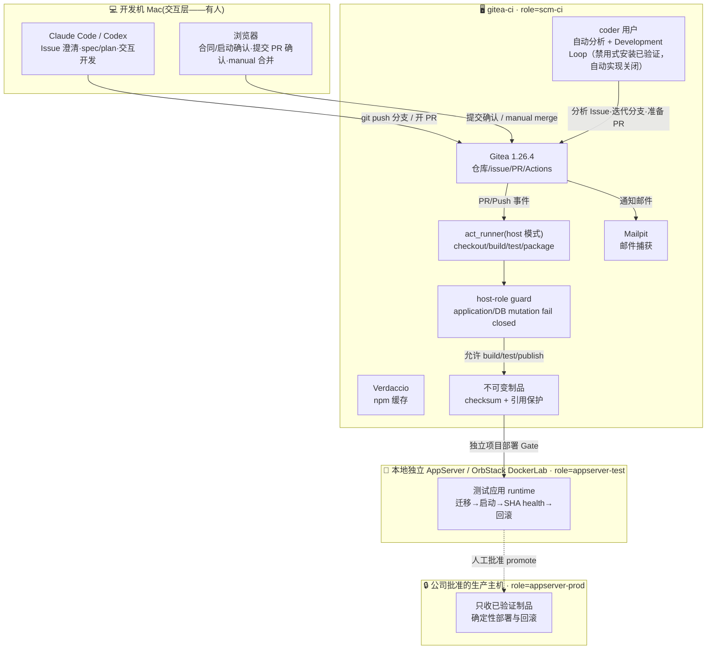

# 软件开发与自动化部署运维平台 · 总纲

> 版本：v3.6（routine PR source contract）｜ 更新：2026-08-26 ｜ 状态：**Issue #208 定义“合同/启动确认 + 提交最终 PR 前确认”两个默认人工点和 routine small 受控自动合并 source 合同；#208、全部 complex/major/阶段完结与强制风险变更仍须人工合并，installed/live 启用仍须单独验收**
>
> 一句话：**Issue 定义工作，AI Loop 把明确合同做到最终 PR；人确认提交，manual 变更由人合并，显式 opt-in 的 routine small 只有在最终 head 全硬门通过后才可由独立 merger 合并；部署始终独立授权。**

本文件是全貌与导航；细节在各主题分册。原始设计文档在 [archive/](archive/)，仅作历史参考。v3 的迁移决策与未实施边界见 [09](09-v3平台简化与Loop-Engineering文档改造规划.md)。

---

## 1. 当前状态（2026-08-26）

- ✅ 基础设施核心：`gitea-ci` 上的 Gitea 1.26.4 + act_runner + Verdaccio + Mailpit
- ✅ 主机职责隔离：Issue #21 已人工合并并以 `completed` 关闭；versioned host profile、capability catalog 和 fail-closed guard 已实现，`gitea-ci` 历史业务 runtime/DB/代理已逐项迁移或清理并完成 live post-check
- 🟡 流水线：PR CI、构建和不可变制品链已验证；历史“合并 main 后在 `gitea-ci` 启动测试应用”仅作 as-built 证据，新接入必须使用独立 `appserver-test` trust role；NewEmaint pilot 的该 role 位于本地 OrbStack DockerLab，不新增第三台公司 VM
- ✅ Legacy 制品收口：`gitea-ci:/opt/artifacts` 只保留 AppServer current 对应的 `rsdesign-new-3323ab...tar.gz`；9 个可由 Gitea commits 重建且无引用的旧版本已按精确路径删除，Gitea repositories 与 AppServer 未修改
- ✅ `prod-sim`：Issue #21 两轮 name+ID/依赖/唯一数据/可重建检查与所有者 disposition 完成后，仅以 `orb delete --force prod-sim` 精确退役；`gitea-ci` 与 AppServer paired health 保持通过
- ✅ v2 试点证据：issue #4 已走通三闸门闭环，证明 Issue/文档/PR/部署关联可行
- ✅ 邮件通知：Gitea → Mailpit（演示层），issue/PR 事件自动发信
- ✅ Codex 基础：CLI、认证、skills、AGENTS、sandbox、provider router 已通过 VM 基础验收
- 🟡 Matt 开发编排层：固定完整 upstream snapshot，`triage → to-spec → to-tickets → implement` 映射到现有 Gitea 合同；Agent 只在当前 exact change branch 本地提交，Controller 在提交确认后才能 push/建 PR/读取 CI；manual 路径仍只由人合并
- ✅ Gitea 身份与可见性历史基线：Issue #35 已在本机 OrbStack 标记 `deployed`；1 个非 site-admin manager、9 个单项目 agent 与 11 个最小 scope PAT 已完成幂等验证，原 live `main` merge allowlist 只含人工 `admin`。Issue #208 只增加独立 per-project routine merger 的 source 合同；未获独立 live apply 授权前，现有 allowlist、credential 与 installed bytes 均不改变
- 🟡 Host access broker：既有 strict typed Issue/PR/Git surface 保持；Issue #208 只允许新增 `gitea.pull.merge.routine(number, sha)`，并要求 broker 在唯一 merge POST 前 fresh 重跑合同、唯一 PR、head、protection、required CI、reviews、dependencies 与 final diff 硬门。Gitea 1.26.4 无 merge-only ACL，ordinary Git 隔离依赖 broker-exclusive credential custody 与 zero fallback；routine identity 不进入 main push/force allowlist。source 合并不等于安装、provision 或 live 启用
- ✅ Claude adapter（Issue #1）：与 Codex 共用 controller/verifier/状态/终态，17 项 parity 测试通过；默认仍 `IMPLEMENT_PROVIDER=none`，真实 VM pilot 未做
- 🟡 v3 文档：Issue 主键、small/complex 双路径、单 PR、单合并闸门、Loop 终态和部署边界已定稿
- 🟡 v3 运行：共享 Codex Loop controller 已在 VM 以 timer 停止、`IMPLEMENT_PROVIDER=none` 的方式验证；rsdesign-new Issue #8 只作为 real complex pilot。中央 source 现提供每项目 profile 和 systemd template，任何项目都必须独立验收后再启用
- ✅ Windows 目标设计：IIS + ASP.NET Core + React `wwwroot` 单制品、PostgreSQL、测试 OpenSSH、生产 SMB + Kerberos WinRM + JEA 的合同已确认
- ✅ 内网协作目标设计：本地 Gitea 长期作为开发权威，私有 GitHub 作为搬运中继，公司 Gitea 作为部署权威；不迁移本地 Issue/PR，公司侧不运行 AI
- ✅ Windows 快速原型设计：Apple Silicon Mac 使用 VMware Fusion + Windows 11 ARM 调试架构无关部署脚本；不替代 Server 2022 x64 和公司 AD 验收
- 🟡 Linux Docker release source（Issue #22 已合并）：提供 strict manifest/profile、Registry/offline transports、host-role preflight 和 deterministic deploy/status/rollback；合同已进入 source，但具体业务 Registry/AppServer 与 production promotion 仍未验收
- ✅ Docker offline V2 source/evidence（Issue #27 已合并）：四类 image identity、release-scoped tag、strict V2 inventory/archive、Engine/Compose/image-store capability gate 与 fake tests 已完成；两个独立 disposable Engine 29 containerd daemon 的 Registry push/pull、save/load、offline pull rejection、Compose `--pull never --no-build`、identity/health 和 exact cleanup E2E 已 `PASS`，containerd row 为 `supported`；classic 没有同等级真实证据，继续 `rejected`。该证据不是 NewEmaint、AppServer 或 production 部署
- ✅ Docker release 分阶段职责与Compose 5.1.4 evidence（Issue #58/#65）：artifact-only verification、read-only target readiness、独立 stage/migrate/activate、state v2 receipt 与 fixed action gate已由两个task-owned disposable Engine 29.7.1/containerd daemon、Compose 5.1.4及disposable PostgreSQL migration真实验证；matrix仅支持exact Engine `[29.7.1,29.7.2)`/Compose `[5.1.4,5.1.5)` row。v1 legacy CLI保持兼容；本状态不表示已部署到NewEmaint、AppServer或production
- 🟡 NewEmaint 公司交付 pilot（Issue #120）：提供 versioned/checksum-pinned operator bundle、两台公司 Linux VM 的脱敏 inventory、Stage 00–110 人工 runbook 与 strict evidence；真实 release handoff、公司 Gitea/Runner/Registry、backup/restore、AppServer 和 production 全部保持 `NOT RUN`
- 🟡 Gitea 隔离安装 source（Issue #126/#128/#130）：operator `1.2.0` 使用 inventory v3、transition v2 与 `greenfield-isolated-install`，只验证 `scm-ci` 独立 `aisoft-gitea` candidate；不探测、不绑定 legacy health。`legacy migration/phase-out`、切流和退役必须另建 Change。1.2.0 公司 Stage 00–50 与安装全部保持 `NOT RUN`；旧 evidence 不可投影为新 PASS
- ⏸️ 待办：Windows Server 2022 x64 原型、内网 Runner/依赖缓存、迁移演练、生产 JEA 彩排与 [14](14-Windows部署与迁移验收清单.md) 全量验收

## 2. 目标职责架构

下图保留 PM2/SQLite **as-built legacy 试点**的交付关系，不是新 Linux 项目的默认目标。新项目
使用受控 builder 一次构建 `linux/amd64` OCI images，由 Gitea Container Registry 或同一
manifest 的 offline bundle 传到隔离的 test/prod trust role；`gitea-ci` 只承担 SCM 与明确
批准的 CI/CD 能力，不运行业务容器。



上图是新项目与收口后的强制职责合同，不是对当前 live 状态的虚假描述。Issue #21 的
`03-verification.md` 分别记录 `gitea-ci` 历史 runtime、AppServer 迁移、数据清理和
`prod-sim` 退役的最终 `PASS` 证据；后续环境健康仍须重新只读核对。

NewEmaint pilot 的物理部署固定为**两台公司 Linux VM + 本地 OrbStack DockerLab**：公司
`gitea-ci/scm-ci` 承担 Gitea、入站、Runner、Registry/cache、artifact-only verification 与受控编排；
本地 DockerLab 承担 `appserver-test`；公司 `appserver/appserver-prod` 承担 runtime、PostgreSQL、Nginx
与 fixed target。公司只消费本地已验证的 exact `docker-release/v2` bytes；公司要求内网重建但没有
隔离测试环境时固定 `BLOCKED`。执行合同见
[`company-delivery/runbook.md`](company-delivery/runbook.md)，本仓库或 PR 状态不代表公司已执行。

## 3. 核心设计原则（不可妥协项）

| # | 原则 | 落点 |
|---|------|------|
| 1 | **一次构建，传不可变制品** | 新 Linux 使用完整 Gitea merge SHA + OCI digests + Compose/architecture checksums；PM2 legacy 使用 tar.gz，Windows 使用 zip；生产只接收测试过的相同字节/identity |
| 2 | **制品与环境配置分离** | Linux `/opt/*/.env`、Windows `shared/config` 等由环境持有；制品不含环境 Secret |
| 3 | **新 Linux Docker-first，PM2 legacy** | builder 一次构建，test/prod 只按 digest pull 或 load；目标机不 build/install/fetch，既有 PM2 应用独立迁移验收前保持不变 |
| 4 | **生产部署 script-only** | AI 可参与首次非生产部署；生产只执行已验证脚本和制品 |
| 5 | **任何变更可逆** | 迁移前备份、releases 多版本保留、健康检查失败可回滚 |
| 6 | **判级、合同与执行分离** | AI 判定有效复杂度；controller 独立校验合同；Loop 不得自行改验收标准或扩大范围 |
| 7 | **只有一个交付闸门** | 最终 PR merge 仍是唯一交付硬闸门；manual 集合只由人合并，只有提交时明确授权且 repository opt-in 的 routine small 才能在最终 head required CI 与全部硬门通过后受控合并 |
| 8 | **主机职责 fail closed** | root-owned profile 同时绑定 hostname 与 machine-id；未知 capability、身份漂移或宽松权限都必须在 mutation 前失败 |
| 9 | **平台审计、项目写入与 routine merger 分离** | manager、project agent、provider、shared bot 都不 merge；启用仓库只额外允许一个独立 non-admin、exact-repo routine merger，未启用仓库仍为 human-only |
| 10 | **仓库 private 默认、public 显式例外** | 当前只允许 `aisoft-platform`、`myapp`、`smoke-test` public；内部应用 private；公司内网重建执行同一分类策略 |

## 4. 端到端流程（双路径、单合并闸门）

```mermaid
sequenceDiagram
    autonumber
    actor U as 你(人)
    participant G as Gitea
    participant A as Analyzer / Loop
    participant M as 人 + Mac 会话
    participant R as act_runner(自动)

    U->>G: 提 Issue + needs-analysis
    A->>A: 判断 type 与 contract_effect，执行强制风险规则
    alt 信息不足、冲突或风险边界不明
        A->>G: 写 summary → awaiting-triage（不写 complexity 标签）
        break 合同未明确，本次不进入 Loop
            U->>G: 澄清 Issue 合同 → 重新分析
        end
    else effective_complexity=small
        A->>G: 写 summary + type/* + complexity/small；合同完整则 approved
    else effective_complexity=complex
        A->>G: 写 summary + type/* + complexity/complex + spec-drafting
        U->>M: 用 to-spec/to-tickets 收敛映射的 spec-* + plan-*
        M->>G: 文档提交到同一 change/N-short-description；合同完整则 approved
    end
    A->>A: $implement frontier Txx → 本地原子 commit → verifier
    A->>G: Controller 校验后推 change/N-short-description → 最终 PR(Closes #N) → pr-open
    R->>G: PR CI 必须绿；失败反馈给 Loop
    Note over U,G: 【提交确认】绑定 Issue/branch/manual 或 routine-auto policy
    alt manual 或任一强制风险
        U->>G: 人审核并合并最终 PR
    else repository opt-in 的 routine small
        A->>G: 最终 head 全硬门通过后由独立 merger 合并
    end
    G->>U: 📬 邮件通知(Mailpit);issue 被 Closes 自动关闭
    alt 变更需要部署
        R->>R: 构建→制品→测试部署→健康检查；生产仅运行已验收脚本
        R->>G: 生命周期改为 deployed
    else 变更明确无需部署
        M->>G: 生命周期改为 completed
    end
```

**实施状态**：Issue #208 的 source 合同不代表 routine merger 已安装、credential 已 provision、protection 已 apply 或任一 repository 已 live opt-in。现有 shared Loop pilot 与 `IMPLEMENT_PROVIDER=none` 边界不变；AISoftPlatform 本身属于 platform governance，#208 及其后续平台变更始终走 manual。PR merge 不能推导测试/生产部署授权或 `deployed` 终态。

平台标签采用三个正交维度：十个 `type/*`、两个 `complexity/*` 和八个 lifecycle，共 20 个；Matt 另加两个 `triage/*` category 与五个 `triage/*` state。source manifest 共 provision 27 个标签（Issue #108 把 `type/*` 扩为 10 个并声明 `area/`、`priority/` 两个项目扩展前缀），但 `triage/ready-for-agent` 不替代平台 `approved`。`completed` 与 `deployed` 互斥，任何接入仓库都必须独立同步并读回，不能把其它仓库状态当作平台全局状态。

## 5. 文档导航

| 分册 | 内容 | 读者场景 |
|------|------|----------|
| [01-基础设施-VM-Gitea-Runner](01-基础设施-VM-Gitea-Runner.md) | VM/Gitea/runner/Verdaccio/Mailpit 搭建与账号体系、端口总表 | 重建环境、内网平移 |
| [02-CI与自动部署流水线](02-CI与自动部署流水线.md) | Linux 试点 PM2/SQLite as-built 流水线证据；环境级部署原则以 onboarding-runbook §4 为准 | 改流水线、排部署问题 |
| [03-Issue/Spec/Plan 与单闸门流程](03-Issue-Spec-Plan与单闸门开发流程.md) | small/complex 双路径、文档绑定、标签语义、最终 PR | 日常使用平台 |
| [04-Matt 编排与 Development Loop](04-Agent编排与定时任务.md) | Matt skills、analyzer、Loop、verifier、终态、provider adapter | 调整 agent 行为 |
| [05-通知与多人协作](05-通知与多人协作.md) | Gitea mailer、Mailpit、事件覆盖、切真实 SMTP | 配通知、加协作者 |
| [06-运维手册与踩坑集](06-运维手册与踩坑集.md) | 日常命令速查、私有 Gitea 访问、17 条实证踩坑、AI 故障包、凭据位置 | 排障必读 |
| [07-内网与生产平移路线](07-内网与生产平移路线.md) | 原型孵化、持续权威分工、备选下线切换和 Linux/Windows 双目标 | 规划内网平移 |
| [08-双工具共存与实施](08-双工具共存与实施.md) | 共享契约、controller/adapter、provider 验证矩阵、部署边界与回滚 | 接入或切换 provider |
| [09-v3 文档改造规划](09-v3平台简化与Loop-Engineering文档改造规划.md) | v3 决策、影响矩阵、迁移顺序、回滚边界 | 审核或实施 v3 |
| [10-AI Issue 判级与标签计划（历史）](archive/10-AI-Issue判级与标签实施计划.md) | 2026-07 初始判级、标签和 wrapper 实施记录 | 仅作历史追溯 |
| [11-Codex Loop runtime 计划（历史）](archive/11-Codex-Loop运行时实施计划.md) | provider-neutral runtime 首轮实施记录 | 仅作历史追溯 |
| [NewEmaint 公司交付 runbook](company-delivery/runbook.md) | 两 VM inventory、exact handoff、Gitea/backup/restore/SCM/fixed-target Stage 00–110 | 逐阶段人工执行与审计 |
| [历史资料索引](archive/README.md) | 已被当前合同替代的方案、实施计划与 v2 一页 PDF | 追溯历史，不作为当前操作入口 |

### 交付形态参考（按项目选用，非部署步骤事实源）

平台只给环境级原则（`skill-for-codex/references/onboarding-runbook.md` §4：Linux 原生 / Linux 容器化 /
Windows 各一段原则 + 全平台一致的流程不变量）。下列材料是项目可按自身环境选用的参考实现、设计与
验收模板，不是任何项目部署步骤的事实源；步骤、脚本、参数与环境差异在项目仓自己的 `docs/` 或脚本
目录声明与实现（项目 `AGENTS.md`「项目事实」写明交付形态与部署方案位置）。

| 参考 | 适用环境 | 内容 | 性质 |
|------|----------|------|------|
| [12-Linux GitHub → Gitea 职责分离方案](12-Linux-GitHub-Gitea-双服务器自动部署方案.md) | Linux 容器化 | GitHub 入站候选、内网 PR、三 role 能力隔离的参考合同 | 参考、非部署步骤事实源 |
| [docker-release/](docker-release/README.md) | Linux 容器化 | Docker-first 发布合同（release manifest、transport、capability gate、CLI）的参考实现 | 参考、非部署步骤事实源 |
| [12-Windows 自动部署方案](12-Windows平台自动部署方案.md) | Windows | IIS/.NET/React/PostgreSQL、制品、OpenSSH、SMB/WinRM/JEA 设计 | 参考、非部署步骤事实源（尚未实施） |
| [13-结果迁移与内网切换手册](13-项目结果迁移与内网切换实施手册.md) | 全环境（内网迁移线） | 不迁 Issue/PR 的结果基线迁移、重建和切换 runbook | 参考、非部署步骤事实源（尚未实施） |
| [14-Windows 部署与迁移验收](14-Windows部署与迁移验收清单.md) | Windows | 构建、部署、数据库、JEA、切换和灾备证据模板 | 参考、非部署步骤事实源（全部 NOT RUN） |
| [15-Fusion Windows ARM 原型](15-VMware-Fusion-Windows-ARM原型实施手册.md) | Windows（Mac 本地原型） | Mac 预检、Fusion/Windows 11 ARM、OpenSSH/IIS 脚本调试和 x64 升级边界 | 参考、非部署步骤事实源 |
| [Architecture catalog V1](architecture/README.md) | 全环境 | strict JSON catalog、profiles、项目 declaration/lock、例外与离线 provenance；交付形态取值由项目如实选取 | 参考、非部署步骤事实源（架构声明与 lock 合同仍由平台维护） |

## 6. 关键地址速查

| 入口 | 地址 |
|------|------|
| Gitea | http://gitea-ci.orb.local:3000；`admin/rsdesign-new` 仅为现有 as-built/pilot 示例，实际目标由项目 profile 指定 |
| 测试环境应用 | 由目标项目的 `appserver-test` profile 指定；NewEmaint pilot 固定为本地 OrbStack DockerLab，历史 `gitea-ci:8091` 已在 Issue #21 收口，不得作为当前入口 |
| Mailpit 收件箱 | http://gitea-ci.orb.local:8025 |
| Verdaccio | http://gitea-ci.orb.local:4873 |
| 凭据边界 | manager audit/mutation 与每项目 agent 使用 repo-external 独立 mode 600 protected credential；历史 admin/`ci-bot` 文件不是正常入口，凭据不得进入仓库、argv 或日志 |
| Mac 工作克隆 | `~/Projects/rsdesign-new`（与 RSDesignTool monorepo 完全独立） |

私有仓库检查不得从匿名 API 开始。先解析目标 project profile/remote，再按 [06 §1.1](06-运维手册与踩坑集.md#11-私有-gitea-的只读检查) 使用最小权限 profile、既有 Git credential、VM-local 管理员只读 helper 或已登录浏览器；`404`/`Repository not found` 在认证与 ACL 未核对前不构成“不存在”证据。

Issue #61/#67/#70 的 broker 与 protected-file 修正已发布；Issue #73 的 manifest-fixed remote source
已进入 protected `main`，逐项目安装/adoption 仍以各自 verification 为准。正常 host 访问统一使用
`/usr/local/libexec/aisoft/host-access-broker`：调用方只传 `--project`、allowlisted `--operation` 和
typed argument，target/identity/checkout/credential store 均来自 strict manifest。broker 自身失败且
host/sandbox 真实状态仍矛盾时才允许 emergency 使用 `orbstack-access-diagnostics`；正常 Gitea/Git/VM
验收不得先调用诊断技能。Git remote name 只能来自 manifest，调用方仍不能传
remote/URL/refspec。项目 adoption 必须逐项目完成 `host.access.audit`、单独获批的 credential provision
（仅当缺失）、`mac.git.bind`、`host.onboarding.check` 和 fresh-session typed canary；不得把静态 file
metadata 或单层 `PASS` 写成端到端 `PASS`。

Issue #35 live reconciliation 已完成；共享 `ci-bot` 账号保留但已退出 manifest 仓库 collaborator。
不得再用共享 bot 接入或维持项目。当前必须以
[`codex/config/gitea-governance.json`](codex/config/gitea-governance.json) 的 exact repository 与
project agent 为准：先只读 check，再一次处理一个明确仓库，回读 manager/agent 权限、visibility、
`main` protection 和 merge allowlist。未知仓库只报告，不得扫描后批量授权、公开或修改。

## 7. 术语

- **Issue 合同**：Issue、有效评论、summary，以及复杂变更的 spec/plan 共同定义的执行边界
- **Development Loop**：在合同内反复实现、验证、自修复和处理 CI 反馈，直到完成或升级给人
- **`approved`**：合同已明确、允许启动 Loop；不授权合并或部署
- **`change/N-short-description`**：Issue N 从分析到最终 PR 共用的单一 readable 分支；`short-description` 是锁定的 2–4 段 lowercase ASCII kebab-case slug
- **`docs/changes/N-short-description/`**：与分支使用相同 `N + slug` 的文档目录；`change/N` 与 `docs/changes/N/` 仅在远端/历史证据存在时作为 legacy 维护入口
- **Host profile**：无 Secret 的主机身份与 capability 合同；live 文件固定为 root-owned `/etc/aisoft/host-profile.json`
- **Host access broker**：Mac host 上的 versioned/allowlisted 访问入口；把 exact project/operation 映射到 Gitea/Git/OrbStack target 与最小权限 identity，不接受任意 shell、URL、credential path 或 merge
- **制品**：带项目、完整 SHA 和 checksum 的不可变字节；`/opt/artifacts` 是本地 legacy staging，必须经过引用保护和 retention dry-run，不能按文件名或年龄直接删除
- **Linux release**：新项目为 `release.json` + digest-pinned OCI images + Compose/architecture checksums；Registry 与 offline bundle 共享同一 release identity
- **PM2 legacy 制品**：`/opt/artifacts/rsdesign-new-<sha>.tar.gz`，只代表既有试点；测过的字节 = 上线的字节
- **Change ID（Windows 目标合同）**：原型 `<项目三字符代码>-NNNN`、正式 `PRD-NNNN`；用于分支、文档、制品和部署记录。现有 runtime 尚未实现该格式
- **权威分工**：持续协作模式下本地 Gitea 是开发权威、公司 Gitea 是部署权威、私有 GitHub 是搬运中继；只有未来彻底下线本地开发平台时才执行 [13 §11](13-项目结果迁移与内网切换实施手册.md#11-phase-h最终权威切换备选路径当前不采用) 的备选权威源切换
- **Architecture declaration/lock**：项目人工维护 `.aisoft/architecture.json`，平台工具生成 byte-identical `architecture.lock.json`；候选 lock 只证明合同可解析，不代表 migration 或 deployment 完成
