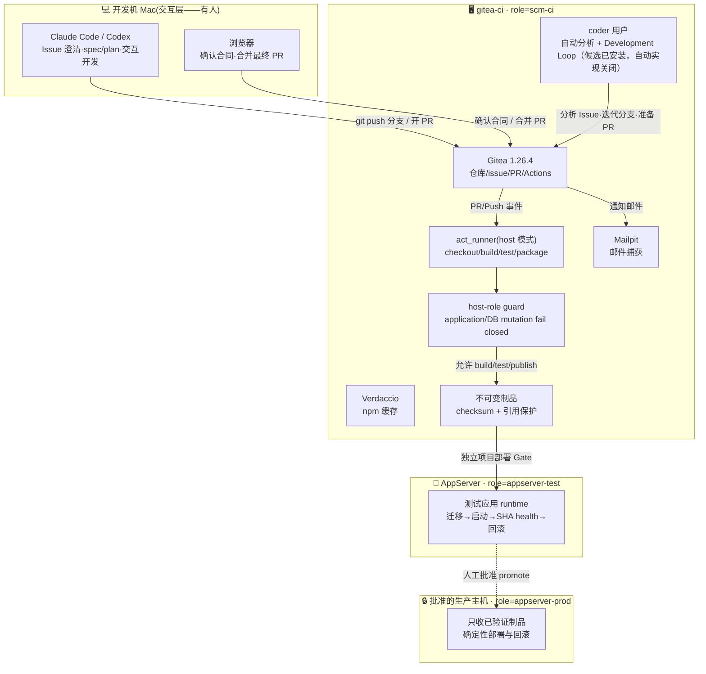

# 软件开发与自动化部署运维平台 · 总纲

> 版本：v3.3（Matt orchestration + deterministic governance candidate）｜ 更新：2026-08-09 ｜ 状态：**Issue #70 正在补齐 governed host writes 的 non-interactive contract；最终 PR 仍只由人合并**
>
> 一句话：**Issue 定义工作，AI Loop 把明确合同做到可审 PR，人决定是否合并；AI 可参与首次非生产部署，生产只运行确定性脚本。**

本文件是全貌与导航；细节在各主题分册。原始设计文档在 [archive/](archive/)，仅作历史参考。v3 的迁移决策与未实施边界见 [09](09-v3平台简化与Loop-Engineering文档改造规划.md)。

---

## 1. 当前状态（2026-08-09）

- ✅ 基础设施核心：`gitea-ci` 上的 Gitea 1.26.4 + act_runner + Verdaccio + Mailpit
- ✅ 主机职责隔离候选：versioned host profile、capability catalog 和 fail-closed guard 已实现；Issue #21 已完成 `gitea-ci` 历史业务 runtime/DB/代理的逐项迁移或清理及 live post-check，等待最终 PR 人工合并
- 🟡 流水线：PR CI、构建和不可变制品链已验证；历史“合并 main 后在 `gitea-ci` 启动测试应用”仅作 as-built 证据，新接入必须部署到独立 `appserver-test`
- ✅ Legacy 制品收口：`gitea-ci:/opt/artifacts` 只保留 AppServer current 对应的 `rsdesign-new-3323ab...tar.gz`；9 个可由 Gitea commits 重建且无引用的旧版本已按精确路径删除，Gitea repositories 与 AppServer 未修改
- ✅ `prod-sim`：Issue #21 两轮 name+ID/依赖/唯一数据/可重建检查与所有者 disposition 完成后，仅以 `orb delete --force prod-sim` 精确退役；`gitea-ci` 与 AppServer paired health 保持通过
- ✅ v2 试点证据：issue #4 已走通三闸门闭环，证明 Issue/文档/PR/部署关联可行
- ✅ 邮件通知：Gitea → Mailpit（演示层），issue/PR 事件自动发信
- ✅ Codex 基础：CLI、认证、skills、AGENTS、sandbox、provider router 已通过 VM 基础验收
- 🟡 Matt 开发编排层（Issue #57 candidate）：固定完整 upstream snapshot，`triage → to-spec → to-tickets → implement` 映射到现有 Gitea 合同；Agent 只在 `change/N` 本地提交，Controller 才能 push/建 PR/读取 CI，合并仍只由人操作
- ✅ Gitea 身份与可见性：Issue #35 已在本机 OrbStack 标记 `deployed`；1 个非 site-admin manager、9 个单项目 agent 与 11 个最小 scope PAT 已完成幂等验证，public 精确为 `aisoft-platform`/`myapp`/`smoke-test`，其余 6 个 private，9 个 `main` 只允许人工 `admin` 合并；真实 Issue/label/Git/PR 正反向验证 9/9 `PASS`，共享 `ci-bot` 已从全部 manifest 仓库移除 collaborator 权限但账号保留
- 🟡 Host access broker（Issue #70 candidate）：Issue #61 的 `host-access-broker/v1` 与 Issue #67 credential protocol 修复已合并；#70 正在补齐 strict typed Issue/PR mutation、独立 worktree exact `change/N` push、repo-external project-scoped protected-file credential boundary、脱敏 access audit 与 exact-prefix fresh-session canary。Mac runtime 不再访问 Keychain，最终 merge 仍只由人工 `admin` 执行
- ✅ Claude adapter（Issue #1）：与 Codex 共用 controller/verifier/状态/终态，17 项 parity 测试通过；默认仍 `IMPLEMENT_PROVIDER=none`，真实 VM pilot 未做
- 🟡 v3 文档：Issue 主键、small/complex 双路径、单 PR、单合并闸门、Loop 终态和部署边界已定稿
- 🟡 v3 运行：共享 Codex Loop controller 已在 VM 以 timer 停止、`IMPLEMENT_PROVIDER=none` 的方式验证；rsdesign-new Issue #8 只作为 real complex pilot。中央 source 现提供每项目 profile 和 systemd template，任何项目都必须独立验收后再启用
- ✅ Windows 目标设计：IIS + ASP.NET Core + React `wwwroot` 单制品、PostgreSQL、测试 OpenSSH、生产 SMB + Kerberos WinRM + JEA 的合同已确认
- ✅ 迁移目标设计：本地 Gitea 原型结果一次性交付公司 Gitea；不迁移 Issue/PR；GitHub 只保留本地镜像，与公司无关
- ✅ Windows 快速原型设计：Apple Silicon Mac 使用 VMware Fusion + Windows 11 ARM 调试架构无关部署脚本；不替代 Server 2022 x64 和公司 AD 验收
- 🟡 Linux Docker release contract（Issue #22 candidate）：提供 strict manifest/profile、Registry/offline transports、host-role preflight 和 deterministic deploy/status/rollback；当前只有 fake Docker 与 installer 证据，未安装/启动 Docker daemon，未执行真实 migration、AppServer 部署或 production promotion
- ✅ Docker offline V2（Issue #27 candidate）：四类 image identity、release-scoped tag、strict V2 inventory/archive、Engine/Compose/image-store capability gate 与 fake tests 已完成；两个独立 disposable Engine 29 containerd daemon 的 Registry push/pull、save/load、offline pull rejection、Compose `--pull never --no-build`、identity/health 和 exact cleanup E2E 已 `PASS`，containerd row 为 `supported`；classic 没有同等级真实证据，继续 `rejected`。该证据不是 NewEmaint、AppServer 或 production 部署
- ✅ Docker release 分阶段职责与Compose 5.1.4 evidence（Issue #58/#65）：artifact-only verification、read-only target readiness、独立 stage/migrate/activate、state v2 receipt 与 fixed action gate已由两个task-owned disposable Engine 29.7.1/containerd daemon、Compose 5.1.4及disposable PostgreSQL migration真实验证；matrix仅支持exact Engine `[29.7.1,29.7.2)`/Compose `[5.1.4,5.1.5)` row。v1 legacy CLI保持兼容；本状态不表示已部署到NewEmaint、AppServer或production
- ⏸️ 待办：Windows Server 2022 x64 原型、内网 Runner/依赖缓存、迁移演练、生产 JEA 彩排与 [14](14-Windows部署与迁移验收清单.md) 全量验收

## 2. 目标职责架构

下图保留 PM2/SQLite **as-built legacy 试点**的交付关系，不是新 Linux 项目的默认目标。新项目
使用受控 builder 一次构建 `linux/amd64` OCI images，由 Gitea Container Registry 或同一
manifest 的 offline bundle 传到独立 test/prod AppServer；`gitea-ci` 只承担 SCM 与明确
批准的 CI/CD 能力，不运行业务容器。



上图是新项目与收口后的强制职责合同，不是对当前 live 状态的虚假描述。Issue #21 的
`03-verification.md` 分别记录 `gitea-ci` 历史 runtime、AppServer 迁移、数据清理和
`prod-sim` 退役是否 `PASS`、`BLOCKED` 或 `NOT RUN`。

## 3. 核心设计原则（不可妥协项）

| # | 原则 | 落点 |
|---|------|------|
| 1 | **一次构建，传不可变制品** | 新 Linux 使用完整 Gitea merge SHA + OCI digests + Compose/architecture checksums；PM2 legacy 使用 tar.gz，Windows 使用 zip；生产只接收测试过的相同字节/identity |
| 2 | **制品与环境配置分离** | Linux `/opt/*/.env`、Windows `shared/config` 等由环境持有；制品不含环境 Secret |
| 3 | **新 Linux Docker-first，PM2 legacy** | builder 一次构建，test/prod 只按 digest pull 或 load；目标机不 build/install/fetch，既有 PM2 应用独立迁移验收前保持不变 |
| 4 | **生产部署 script-only** | AI 可参与首次非生产部署；生产只执行已验证脚本和制品 |
| 5 | **任何变更可逆** | 迁移前备份、releases 多版本保留、健康检查失败可回滚 |
| 6 | **判级、合同与执行分离** | AI 判定有效复杂度；controller 独立校验合同；Loop 不得自行改验收标准或扩大范围 |
| 7 | **只有一个交付闸门** | 最终 PR 合并是唯一交付硬闸门；PR CI 必须绿且只有人能合并 `main` |
| 8 | **主机职责 fail closed** | root-owned profile 同时绑定 hostname 与 machine-id；未知 capability、身份漂移或宽松权限都必须在 mutation 前失败 |
| 9 | **平台审计与项目写入分离** | 平台 manager 只在显式受管仓库 Admin；每项目 agent 只对自己的仓库 Write；`main` merge allowlist 只含人工身份 |
| 10 | **仓库 private 默认、public 显式例外** | 当前只允许 `aisoft-platform`、`myapp`、`smoke-test` public；内部应用 private；公司内网重建执行同一分类策略 |

## 4. 端到端流程（双路径、单合并闸门）

```mermaid
sequenceDiagram
    autonumber
    actor U as 你(人)
    participant G as Gitea
    participant A as Analyzer / Loop
    participant M as 人 + Mac 会话
    participant R as act_runner(自动)

    U->>G: 提 Issue + needs-analysis
    A->>A: 判断 type 与 contract_effect，执行强制风险规则
    alt 信息不足、冲突或风险边界不明
        A->>G: 写 summary → awaiting-triage（不写 complexity 标签）
        break 合同未明确，本次不进入 Loop
            U->>G: 澄清 Issue 合同 → 重新分析
        end
    else effective_complexity=small
        A->>G: 写 summary + type/* + complexity/small；合同完整则 approved
    else effective_complexity=complex
        A->>G: 写 summary + type/* + complexity/complex + spec-drafting
        U->>M: 用 to-spec/to-tickets 收敛映射的 spec-* + plan-*
        M->>G: 文档提交到同一 change/N；合同完整则 approved
    end
    A->>A: $implement frontier Txx → 本地原子 commit → verifier
    A->>G: Controller 校验后推 change/N → 最终 PR(Closes #N) → pr-open
    R->>G: PR CI 必须绿；失败反馈给 Loop
    Note over U,G: 【唯一交付闸门】人审核并合并最终 PR
    G->>U: 📬 邮件通知(Mailpit);issue 被 Closes 自动关闭
    alt 变更需要部署
        R->>R: 构建→制品→测试部署→健康检查；生产仅运行已验收脚本
        R->>G: 生命周期改为 deployed
    else 变更明确无需部署
        M->>G: 生命周期改为 completed
    end
```

**实施状态**：AI 自动分析仍可用；共享 Codex Development Loop 候选已完成 synthetic、临时 HOME、VM 禁用式安装和 rsdesign-new real complex pilot，PR #9 已由人合并，合并后两个测试入口健康。该 pilot 只证明通用 controller 能在一个应用工作，不把平台绑定到该仓库。每个目标项目由独立 profile 指定 Gitea 坐标、clone、provider、state 和 worktrees，默认 `IMPLEMENT_PROVIDER=none`。AISoftPlatform 是文档、模板、skills 与 runtime source 仓库，本身不需要应用部署流水线。Claude Code Loop 和生产相关自动操作仍未启用。

平台标签采用三个正交维度：七个 `type/*`、两个 `complexity/*` 和八个 lifecycle，共 17 个；Matt 另加两个 `triage/*` category 与五个 `triage/*` state。source manifest 共 provision 24 个标签，但 `triage/ready-for-agent` 不替代平台 `approved`。`completed` 与 `deployed` 互斥，任何接入仓库都必须独立同步并读回，不能把其它仓库状态当作平台全局状态。

## 5. 文档导航

| 分册 | 内容 | 读者场景 |
|------|------|----------|
| [01-基础设施-VM-Gitea-Runner](01-基础设施-VM-Gitea-Runner.md) | VM/Gitea/runner/Verdaccio/Mailpit 搭建与账号体系、端口总表 | 重建环境、内网平移 |
| [02-CI与自动部署流水线](02-CI与自动部署流水线.md) | Docker-first 默认合同与 PM2/SQLite as-built legacy 证据 | 改流水线、排部署问题 |
| [03-Issue/Spec/Plan 与单闸门流程](03-Issue-Spec-Plan与单闸门开发流程.md) | small/complex 双路径、文档绑定、标签语义、最终 PR | 日常使用平台 |
| [04-Matt 编排与 Development Loop](04-Agent编排与定时任务.md) | Matt skills、analyzer、Loop、verifier、终态、provider adapter | 调整 agent 行为 |
| [05-通知与多人协作](05-通知与多人协作.md) | Gitea mailer、Mailpit、事件覆盖、切真实 SMTP | 配通知、加协作者 |
| [06-运维手册与踩坑集](06-运维手册与踩坑集.md) | 日常命令速查、私有 Gitea 访问、16 条实证踩坑、AI 故障包、凭据位置 | 排障必读 |
| [07-内网与生产平移路线](07-内网与生产平移路线.md) | 原型孵化、结果迁移、权威源切换和 Linux/Windows 双目标 | 规划内网平移 |
| [08-Codex-first 与双工具共存](08-Codex双工具共存与实施.md) | 共享 controller、Codex 验证矩阵、Claude parity 条件 | 接入或切换 provider |
| [09-v3 文档改造规划](09-v3平台简化与Loop-Engineering文档改造规划.md) | v3 决策、影响矩阵、迁移顺序、回滚边界 | 审核或实施 v3 |
| [10-AI Issue 判级与标签计划](10-AI-Issue判级与标签实施计划.md) | 判级、标签和 wrapper 实施记录 | 追溯 analyzer 设计 |
| [11-Codex Loop runtime 计划](11-Codex-Loop运行时实施计划.md) | provider-neutral runtime 与验证计划 | 追溯 Loop 实现 |
| [12-Windows 自动部署方案](12-Windows平台自动部署方案.md) | IIS/.NET/React/PostgreSQL、制品、OpenSSH、SMB/WinRM/JEA | 建设 Windows 交付链 |
| [13-结果迁移与内网切换手册](13-项目结果迁移与内网切换实施手册.md) | 不迁 Issue/PR 的结果基线迁移、重建和切换 runbook | 执行项目迁移 |
| [14-Windows 部署与迁移验收](14-Windows部署与迁移验收清单.md) | 构建、部署、数据库、JEA、切换和灾备证据 | 正式上线验收 |
| [15-Fusion Windows ARM 原型](15-VMware-Fusion-Windows-ARM原型实施手册.md) | Mac 预检、Fusion/Windows 11 ARM、OpenSSH/IIS 脚本调试和 x64 升级边界 | 本地快速原型 |
| [12-Linux GitHub → Gitea 职责分离方案](12-Linux-GitHub-Gitea-双服务器自动部署方案.md) | GitHub 入站候选、内网 PR、`scm-ci`/测试/生产三角色目标合同 | 建设 Linux 内网交付链 |
| [Architecture catalog V1](architecture/README.md) | strict JSON catalog、三个 profiles、项目 declaration/lock、例外与离线 provenance | 选择技术基线、审计项目或规划升级 |

## 6. 关键地址速查

| 入口 | 地址 |
|------|------|
| Gitea | http://gitea-ci.orb.local:3000；`admin/rsdesign-new` 仅为现有 as-built/pilot 示例，实际目标由项目 profile 指定 |
| 测试环境应用 | 由目标项目的 `appserver-test` profile 指定；`gitea-ci:8091` 只是 Issue #21 待迁移的 legacy 入口 |
| Mailpit 收件箱 | http://gitea-ci.orb.local:8025 |
| Verdaccio | http://gitea-ci.orb.local:4873 |
| 凭据文件 | as-built：gitea-ci VM `~benque/gitea-ci-credentials.txt`（admin/ci-bot；600）；Issue #35 合并后由独立 mode 600 文件承载 manager audit/mutation 和每项目 PAT，互不复用 |
| Mac 工作克隆 | `~/Projects/rsdesign-new`（与 RSDesignTool monorepo 完全独立） |

私有仓库检查不得从匿名 API 开始。先解析目标 project profile/remote，再按 [06 §1.1](06-运维手册与踩坑集.md#11-私有-gitea-的只读检查) 使用最小权限 profile、既有 Git credential、VM-local 管理员只读 helper 或已登录浏览器；`404`/`Repository not found` 在认证与 ACL 未核对前不构成“不存在”证据。

Issue #61 已发布并完成 post-merge 安装；正常 host 访问统一使用
`/usr/local/libexec/aisoft/host-access-broker`：调用方只传 `--project`、allowlisted `--operation` 和
typed argument，target/identity/checkout/credential store 均来自 strict manifest。broker 自身失败且
host/sandbox 真实状态仍矛盾时才允许 emergency 使用 `orbstack-access-diagnostics`；正常 Gitea/Git/VM
验收不得先调用诊断技能。Issue #70 发布前，新增 Issue/PR writes、独立 worktree push、protected-file
store 与 fresh-session 零重复授权只属于 candidate/live-canary 证据；不得把静态 file metadata 或
exact-prefix 单层 `PASS` 写成端到端 `PASS`。

Issue #35 发布前，固定 `ci-bot` + `write` collaborator gate 仅作为已有 profile 的兼容路径；
不得继续用共享 bot 接入新项目。发布后必须以
[`codex/config/gitea-governance.json`](codex/config/gitea-governance.json) 的 exact repository 与
project agent 为准：先只读 check，再一次处理一个明确仓库，回读 manager/agent 权限、visibility、
`main` protection 和 merge allowlist。未知仓库只报告，不得扫描后批量授权、公开或修改。

## 7. 术语

- **Issue 合同**：Issue、有效评论、summary，以及复杂变更的 spec/plan 共同定义的执行边界
- **Development Loop**：在合同内反复实现、验证、自修复和处理 CI 反馈，直到完成或升级给人
- **`approved`**：合同已明确、允许启动 Loop；不授权合并或部署
- **`change/N`**：Issue N 从分析到最终 PR 共用的单一分支
- **`docs/changes/N/`**：summary、复杂变更的 spec/plan，以及部署/迁移变更的 verification
- **Host profile**：无 Secret 的主机身份与 capability 合同；live 文件固定为 root-owned `/etc/aisoft/host-profile.json`
- **Host access broker**：Mac host 上的 versioned/allowlisted 访问入口；把 exact project/operation 映射到 Gitea/Git/OrbStack target 与最小权限 identity，不接受任意 shell、URL、credential path 或 merge
- **制品**：带项目、完整 SHA 和 checksum 的不可变字节；`/opt/artifacts` 是本地 legacy staging，必须经过引用保护和 retention dry-run，不能按文件名或年龄直接删除
- **Linux release**：新项目为 `release.json` + digest-pinned OCI images + Compose/architecture checksums；Registry 与 offline bundle 共享同一 release identity
- **PM2 legacy 制品**：`/opt/artifacts/rsdesign-new-<sha>.tar.gz`，只代表既有试点；测过的字节 = 上线的字节
- **Change ID（Windows 目标合同）**：原型 `<项目三字符代码>-NNNN`、正式 `PRD-NNNN`；用于分支、文档、制品和部署记录。现有 runtime 尚未实现该格式
- **权威源切换**：迁移前本地 Gitea 是原型权威源；迁移后公司 Gitea 是唯一正式权威源，GitHub 不进入公司链路
- **Architecture declaration/lock**：项目人工维护 `.aisoft/architecture.json`，平台工具生成 byte-identical `architecture.lock.json`；候选 lock 只证明合同可解析，不代表 migration 或 deployment 完成
