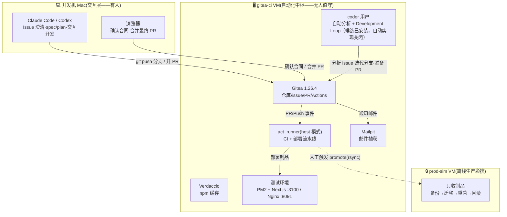

# 软件开发与自动化部署运维平台 · 总纲

> 版本：v3.0（通用 Codex runtime candidate）｜ 更新：2026-07-16 ｜ 状态：**共享 runtime、每项目 profile、synthetic 与一个真实 complex pilot 已验证；平台仓库本身不部署，完成中央回归后进入 Claude Code 通用适配**
>
> 一句话：**Issue 定义工作，AI Loop 把明确合同做到可审 PR，人决定是否合并；AI 可参与首次非生产部署，生产只运行确定性脚本。**

本文件是全貌与导航；细节在各主题分册。原始设计文档在 [archive/](archive/)，仅作历史参考。v3 的迁移决策与未实施边界见 [09](09-v3平台简化与Loop-Engineering文档改造规划.md)。

---

## 1. 当前状态（2026-07-16）

- ✅ 基础设施：OrbStack 双 VM（gitea-ci / prod-sim）、Gitea 1.26.4 + act_runner + Verdaccio + Mailpit
- ✅ 流水线：PR 触发 CI；合并 main 自动「构建 → 自包含制品 → 部署测试环境 → 健康检查」
- ✅ v2 试点证据：issue #4 已走通三闸门闭环，证明 Issue/文档/PR/部署关联可行
- ✅ 邮件通知：Gitea → Mailpit（演示层），issue/PR 事件自动发信
- ✅ Codex 基础：CLI、认证、skills、AGENTS、sandbox、provider router 已通过 VM 基础验收
- 🟡 v3 文档：Issue 主键、small/complex 双路径、单 PR、单合并闸门、Loop 终态和部署边界已定稿
- 🟡 v3 运行：共享 Codex Loop controller 已在 VM 以 timer 停止、`IMPLEMENT_PROVIDER=none` 的方式验证；rsdesign-new Issue #8 只作为 real complex pilot。中央 source 现提供每项目 profile 和 systemd template，任何项目都必须独立验收后再启用
- ⏸️ 待办：deploy 回帖 issue、prod-sim 离线彩排、内网平移（见 [07-内网与生产平移路线](07-内网与生产平移路线.md)）

## 2. 三层架构



## 3. 核心设计原则（不可妥协项）

| # | 原则 | 落点 |
|---|------|------|
| 1 | **一次构建，传自包含制品** | 对需要部署的应用，测试机构建自包含 `<repo>-<sha>.tar.gz`；rsdesign-new 是现有 as-built 示例，生产只解压已验收字节 |
| 2 | **制品与环境配置分离** | 各机 `/opt/*/.env` 本地持有，部署时注入；制品零环境信息 |
| 3 | **整体去 Docker 化** | PM2 + 制品 + Verdaccio 缓存，绕开弱网 docker build 之痛 |
| 4 | **生产部署 script-only** | AI 可参与首次非生产部署；生产只执行已验证脚本和制品 |
| 5 | **任何变更可逆** | 迁移前备份、releases 多版本保留、健康检查失败可回滚 |
| 6 | **判级、合同与执行分离** | AI 判定有效复杂度；controller 独立校验合同；Loop 不得自行改验收标准或扩大范围 |
| 7 | **只有一个交付闸门** | 最终 PR 合并是唯一交付硬闸门；PR CI 必须绿且只有人能合并 `main` |

## 4. 端到端流程（双路径、单合并闸门）

```mermaid
sequenceDiagram
    autonumber
    actor U as 你(人)
    participant G as Gitea
    participant A as Analyzer / Loop
    participant M as 人 + Mac 会话
    participant R as act_runner(自动)

    U->>G: 提 Issue + needs-analysis
    A->>A: 判断 type 与 contract_effect，执行强制风险规则
    alt 信息不足、冲突或风险边界不明
        A->>G: 写 summary → awaiting-triage（不写 complexity 标签）
        break 合同未明确，本次不进入 Loop
            U->>G: 澄清 Issue 合同 → 重新分析
        end
    else effective_complexity=small
        A->>G: 写 summary + type/* + complexity/small；合同完整则 approved
    else effective_complexity=complex
        A->>G: 写 summary + type/* + complexity/complex + spec-drafting
        U->>M: 收敛决策，写 01-spec.md + 02-plan.md
        M->>G: 文档提交到同一 change/N；合同完整则 approved
    end
    A->>A: 实现→测试→失败分析→修复→再验证
    A->>G: 推 change/N → 最终 PR(Closes #N) → pr-open
    R->>G: PR CI 必须绿；失败反馈给 Loop
    Note over U,G: 【唯一交付闸门】人审核并合并最终 PR
    R->>R: 构建→制品→测试部署→健康检查；生产仅运行已验收脚本
    G->>U: 📬 邮件通知(Mailpit);issue 被 Closes 自动关闭
```

**实施状态**：AI 自动分析仍可用；共享 Codex Development Loop 候选已完成 synthetic、临时 HOME、VM 禁用式安装和 rsdesign-new real complex pilot，PR #9 已由人合并，合并后两个测试入口健康。该 pilot 只证明通用 controller 能在一个应用工作，不把平台绑定到该仓库。每个目标项目由独立 profile 指定 Gitea 坐标、clone、provider、state 和 worktrees，默认 `IMPLEMENT_PROVIDER=none`。AISoftPlatform 是文档、模板、skills 与 runtime source 仓库，本身不需要应用部署流水线。Claude Code Loop 和生产相关自动操作仍未启用。

标签采用三个正交维度：七个 `type/*` 描述变更是什么，两个 `complexity/*` 记录 AI 判定所需路径，七个流程状态标签描述当前阶段。`complexity/small` 不能绕过强制复杂规则；无法安全判级时不添加 complexity 标签。16-label taxonomy 已在一个试点仓库完成幂等复验，但标签必须对每个接入仓库独立 provision 和读回，不能把试点外部状态当作平台全局状态。

## 5. 文档导航

| 分册 | 内容 | 读者场景 |
|------|------|----------|
| [01-基础设施-VM-Gitea-Runner](01-基础设施-VM-Gitea-Runner.md) | VM/Gitea/runner/Verdaccio/Mailpit 搭建与账号体系、端口总表 | 重建环境、内网平移 |
| [02-CI与自动部署流水线](02-CI与自动部署流水线.md) | ci.yml、deploy-test.yml、制品/部署脚本、SQLite 约束、回滚 | 改流水线、排部署问题 |
| [03-Issue/Spec/Plan 与单闸门流程](03-Issue-Spec-Plan与单闸门开发流程.md) | small/complex 双路径、文档绑定、标签语义、最终 PR | 日常使用平台 |
| [04-AI 分析与 Development Loop](04-Agent编排与定时任务.md) | analyzer、Loop、verifier、终态、provider adapter | 调整 agent 行为 |
| [05-通知与多人协作](05-通知与多人协作.md) | Gitea mailer、Mailpit、事件覆盖、切真实 SMTP | 配通知、加协作者 |
| [06-运维手册与踩坑集](06-运维手册与踩坑集.md) | 日常命令速查、14 条实证踩坑、AI 故障包、凭据位置 | 排障必读 |
| [07-内网与生产平移路线](07-内网与生产平移路线.md) | 阶段 3/4 映射、双网拓扑、前提清单、待办增强 | 规划下一步 |
| [08-Codex-first 与双工具共存](08-Codex双工具共存与实施.md) | 共享 controller、Codex 验证矩阵、Claude parity 条件 | 接入或切换 provider |
| [09-v3 文档改造规划](09-v3平台简化与Loop-Engineering文档改造规划.md) | v3 决策、影响矩阵、迁移顺序、回滚边界 | 审核或实施 v3 |

## 6. 关键地址速查

| 入口 | 地址 |
|------|------|
| Gitea | http://gitea-ci.orb.local:3000；`admin/rsdesign-new` 仅为现有 as-built/pilot 示例，实际目标由项目 profile 指定 |
| 测试环境应用 | http://gitea-ci.orb.local:8091 |
| Mailpit 收件箱 | http://gitea-ci.orb.local:8025 |
| Verdaccio | http://gitea-ci.orb.local:4873 |
| 凭据文件 | gitea-ci VM `~benque/gitea-ci-credentials.txt`（admin/ci-bot；600） |
| Mac 工作克隆 | `~/Projects/rsdesign-new`（与 RSDesignTool monorepo 完全独立） |

## 7. 术语

- **Issue 合同**：Issue、有效评论、summary，以及复杂变更的 spec/plan 共同定义的执行边界
- **Development Loop**：在合同内反复实现、验证、自修复和处理 CI 反馈，直到完成或升级给人
- **`approved`**：合同已明确、允许启动 Loop；不授权合并或部署
- **`change/N`**：Issue N 从分析到最终 PR 共用的单一分支
- **`docs/changes/N/`**：summary、复杂变更的 spec/plan，以及部署/迁移变更的 verification
- **制品**：`/opt/artifacts/rsdesign-new-<sha>.tar.gz`，测过的字节 = 上线的字节
