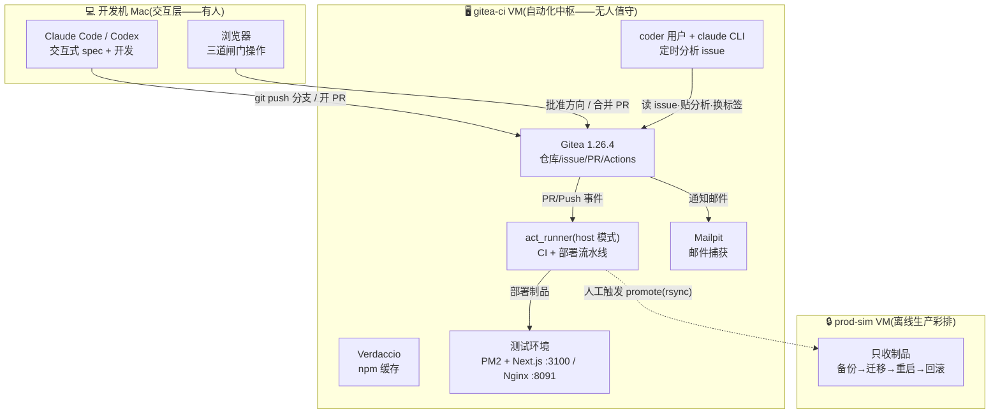

# 软件开发与自动化部署运维平台 · 总纲

> 版本：v2.0（as-built）｜ 更新：2026-07-11 ｜ 状态：**阶段 2.6 试点闭环已走通**（试点仓库 rsdesign-new）
>
> 一句话：**AI 只碰「理解 issue、写代码」，act_runner 只碰「构建、迁移、重启」，人站在三道闸门上。部署链路里没有 AI。**

本文件是全貌与导航；细节在各主题分册。原始设计文档（试点前）在 [archive/](archive/)，仅作历史参考——**口径以本套 v2.0 文档为准**。

---

## 1. 当前状态（2026-07-11）

- ✅ 基础设施：OrbStack 双 VM（gitea-ci / prod-sim）、Gitea 1.26.4 + act_runner + Verdaccio + Mailpit
- ✅ 流水线：PR 触发 CI；合并 main 自动「构建 → 自包含制品 → 部署测试环境 → 健康检查」
- ✅ Spec 驱动闭环：issue #4 完整走通「分析 → 闸门A → spec/plan → spec PR → 闸门B → 实现 → code PR → 闸门C → 自动部署 → issue 自动关闭」
- ✅ 邮件通知：Gitea → Mailpit（演示层），issue/PR 事件自动发信
- ⏸️ 待办：deploy 回帖 issue、prod-sim 离线彩排、内网平移（见 [07-内网与生产平移路线](07-内网与生产平移路线.md)）

## 2. 三层架构



## 3. 核心设计原则（不可妥协项）

| # | 原则 | 落点 |
|---|------|------|
| 1 | **一次构建，传自包含制品** | 测试机构建 `rsdesign-new-<sha>.tar.gz`（含 node_modules + Prisma 引擎），生产只解压，永不安装 |
| 2 | **制品与环境配置分离** | 各机 `/opt/*/.env` 本地持有，部署时注入；制品零环境信息 |
| 3 | **整体去 Docker 化** | PM2 + 制品 + Verdaccio 缓存，绕开弱网 docker build 之痛 |
| 4 | **部署链路无 AI** | 合并之后全是确定性脚本；AI 到「开 PR」为止 |
| 5 | **任何变更可逆** | 迁移前备份、releases 多版本保留、健康检查失败可回滚 |

## 4. 端到端流程（三道人工闸门）

```mermaid
sequenceDiagram
    autonumber
    actor U as 你(人)
    participant G as Gitea
    participant A as VM Agent(自动)
    participant M as Mac 会话(交互)
    participant R as act_runner(自动)

    U->>G: 提 issue + 打标签 needs-analysis
    A->>G: ≤15min:读仓库分析 → 00-summary.md(spec/N 分支) + 🤖评论 → awaiting-triage
    Note over U,G: 【闸门A】确认方向 → 打 spec-drafting
    U->>M: 交互 brainstorm(关键决策收敛)
    M->>G: 01-spec.md + 02-plan.md → 开 docs-only spec PR(Refs #N) → spec-review
    Note over U,G: 【闸门B】审 spec PR → 合并(spec 进 main) → 打 approved
    M->>M: 按 main 上的 spec/plan 实现(TDD) → npm test 硬门
    M->>G: 推 change/N → 开 code PR(Closes #N) → pr-open
    R->>G: CI:安装→生成→迁移→测试→构建(必须绿)
    Note over U,G: 【闸门C】审 code PR → 合并
    R->>R: 构建→打制品→停应用→迁移→切软链→启动→健康检查
    G->>U: 📬 邮件通知(Mailpit);issue 被 Closes 自动关闭
```

**分工现状（2026-07-11 演进后）**：分析 = VM 无人值守；spec 与实现 = **Mac 本机交互**（Claude Code / Codex，人深度参与）；VM 无人值守实现腿保留但停用（`poll.sh` 内注释，随时可恢复或换 Codex）。

## 5. 文档导航

| 分册 | 内容 | 读者场景 |
|------|------|----------|
| [01-基础设施-VM-Gitea-Runner](01-基础设施-VM-Gitea-Runner.md) | VM/Gitea/runner/Verdaccio/Mailpit 搭建与账号体系、端口总表 | 重建环境、内网平移 |
| [02-CI与自动部署流水线](02-CI与自动部署流水线.md) | ci.yml、deploy-test.yml、制品/部署脚本、SQLite 约束、回滚 | 改流水线、排部署问题 |
| [03-Spec驱动工作流与三闸门](03-Spec驱动工作流与三闸门.md) | ID 绑定、docs/changes、标签状态机、闸门操作、实例走查 | 日常使用平台 |
| [04-Agent编排与定时任务](04-Agent编排与定时任务.md) | coder 用户、五脚本、systemd timer、认证、Codex 接缝 | 调整 agent 行为 |
| [05-通知与多人协作](05-通知与多人协作.md) | Gitea mailer、Mailpit、事件覆盖、切真实 SMTP | 配通知、加协作者 |
| [06-运维手册与踩坑集](06-运维手册与踩坑集.md) | 日常命令速查、11 条实证踩坑、凭据位置 | 排障必读 |
| [07-内网与生产平移路线](07-内网与生产平移路线.md) | 阶段 3/4 映射、双网拓扑、前提清单、待办增强 | 规划下一步 |

## 6. 关键地址速查

| 入口 | 地址 |
|------|------|
| Gitea | http://gitea-ci.orb.local:3000 （仓库 `admin/rsdesign-new`） |
| 测试环境应用 | http://gitea-ci.orb.local:8091 |
| Mailpit 收件箱 | http://gitea-ci.orb.local:8025 |
| Verdaccio | http://gitea-ci.orb.local:4873 |
| 凭据文件 | gitea-ci VM `~benque/gitea-ci-credentials.txt`（admin/ci-bot；600） |
| Mac 工作克隆 | `~/Projects/rsdesign-new`（与 RSDesignTool monorepo 完全独立） |

## 7. 术语

- **闸门 A/B/C**：确认方向 / 合并 spec PR / 合并 code PR——三处唯一需要人的地方
- **`spec/N` / `change/N`**：issue N 的文档分支 / 代码分支
- **`docs/changes/N/`**：issue N 的 00-summary、01-spec、02-plan，随 PR 进 main，永久可追溯
- **制品**：`/opt/artifacts/rsdesign-new-<sha>.tar.gz`，测过的字节 = 上线的字节
