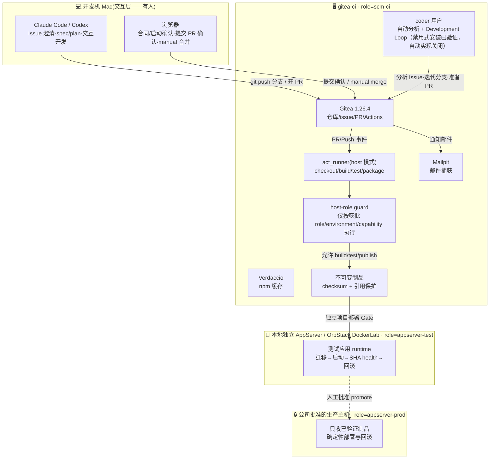
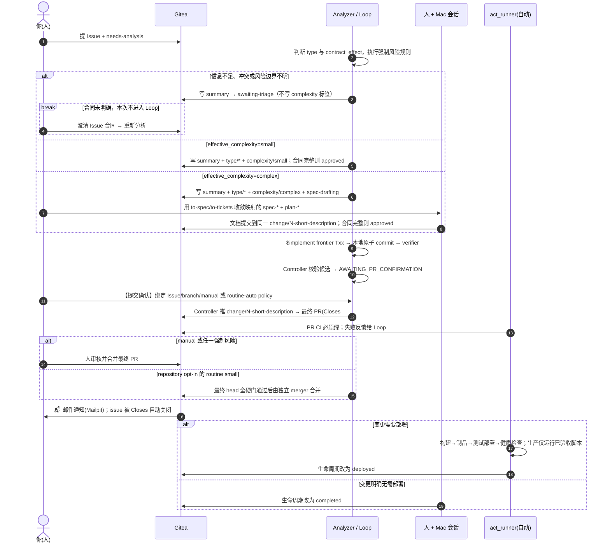

# 软件开发与自动化部署运维平台 · 总纲

> 版本：v3.6（平台合同；本文同步稳定源码）｜ 文档核对：2026-10-04 ｜ 源码基线：`dc9aa468580f92a73dfa054c6f04ef5113f56694`（2026-10-03 已合并 `main`）
>
> 一句话：**Issue 定义工作，AI Loop 把明确合同做到最终 PR；人确认提交，manual 变更由人合并，显式 opt-in 的 routine small 只有在最终 head 全硬门通过后才可由独立 merger 合并；部署始终独立授权。**

本文件是全貌与导航；细节在各主题分册。原始设计文档在 [archive/](archive/)，仅作历史参考。v3 的迁移决策与未实施边界见 [09](09-v3平台简化与Loop-Engineering文档改造规划.md)。

---

## 1. 当前状态（2026-10-04 核对）

“稳定源码”指 Gitea 受保护 `main` 上已经人工合并的版本，不等于本机已安装、项目已采用或公司已部署。
本文按上述 exact SHA 核对；完整审查与变更来源见
[#334 verification](docs/changes/334-refresh-platform-docs/verification-refresh-platform-docs-261004.md)。
历史现场证据保留原日期，本次没有重新验收 VM 服务、凭据或业务环境。

| 领域 | 已合并能力 / 证据 | 安装与现场边界 |
|---|---|---|
| 基础设施与 Runner | `gitea-ci` 的 Gitea 1.26.4、act_runner、Verdaccio、Mailpit 为既有 as-built；#309 记录 Flutter 3.32.8 / unzip 验收；#311 保留 SFMDigitalBoard 在用 Node 22 并补来源记录 | Node 22 安装者、安装日期和上游 provenance 仍为 `unknown`；历史服务验收不代表今日健康，见 [01](01-基础设施-VM-Gitea-Runner.md) |
| 治理集合与 CI | manifest 共 6 仓：AISoftPlatform、LocalWMS、NewEMaint、SFMDigitalBoard、myapp、smoke-test；#252 退出的五个业务项目中仅 SFMDigitalBoard 经 #275 重新接入，`vm_profile: null`；#312 同步 NewEMaint required contexts | 当前集合见 [manifest](codex/config/gitea-governance.json)；#299 保留平台仓 outdated-branch gate，internal-application 的关闭须具备合并预览与 push-main CI，逐仓验收 |
| Matt / 双 provider | 固定 Matt v1.2.2 snapshot；`triage → to-spec → to-tickets → implement`；#318 修齐 Codex/Claude 会话和接入合同，#320 明确每次 push 的 SHA 核对 | adapters 等价、可互换；默认 `IMPLEMENT_PROVIDER=none`，真实 provider / 项目启用矩阵仍须独立完成，见 [08](08-双工具共存与实施.md) |
| Worktree 与文档硬门 | #298 单写者 claim / broker 归属闸门，#304 记录两机安装；#289 严格校验 `required_docs` 声明、映射和实际文件，resolver / Loop / 终态工具共享结果 | #289 runtime 与本地验证已完成；source 之外按安装证据验收；另一会话不得代写 worktree，见 [03](03-Issue-Spec-Plan与单闸门开发流程.md) |
| Broker / routine merge | typed Issue/PR/Actions/Git 与 #208 独立 merger 全硬门；#313 补 routine scope 的 `read:user`；#286 增 manifest 限定只读跨仓依赖，唯一新增边为 `sfm-digital-board → aisoft-platform` | AISoftPlatform `routine_auto_merge_enabled=false`，始终 manual；routine 身份、scope、protection 与真实 opt-in 逐仓读回，不能由源码存在推导启用 |
| 安装与漂移 | 8 个 installer 共用 source guard；#308 提供 [check-installed-drift](codex/tools/check-installed-drift.sh)，按受管字节、权限、链接与可读量检查 `PASS/GAP` | checker 已进入 source；#308 基线的真实安装 GAP 保留，后续修复须独立验收；`source-only` 不是 installed PASS，见 [06](06-运维手册与踩坑集.md) |
| 架构合同 | [architecture](architecture/README.md) 有 5 个 profiles；#284 增 `linux-node-sqlite-v1`；#287 writer 默认 V2 lock，reader 严格接受 V1/V2；#288 离线核验 Dockerfile FROM digest | catalog 固定 `2026.09.0`，不是自动追随 upstream latest；release reader 仍仅接受 V1 architecture lock，下游采用 V2 必须先解决读取链兼容 |
| Docker release | [docker-release](docker-release/README.md) 提供 v1/v2、两种 transport 与确定性阶段；#290 支持仅 test 的 `scm-ci` 共置；#296 增 exact Docker 28.1.1 / Compose 2.35.1 classic 验证行；#305 修 migration identity；#317 增数据库兼容回退硬门 | 兼容矩阵是精确版本组合，不是 Docker 28/29 全部支持；#317 state v3 和兼容依据需目标侧采用，installed/company live 与 production promotion 不由本地测试推导 |
| 公司平台交付 | [company-delivery](company-delivery/README.md) 当前 operator 1.3.0；#270 独立 [platform-bootstrap/v1](platform-bootstrap/README.md)；#271/#274/#278/#280/#282 提供 profile-bound 基线与原因分类诊断 | bootstrap 现场执行器仍 `unbound`；基线、诊断和应用交付是不同入口，项目现场阶段由项目仓记录，本仓不投影为公司 PASS |
| 开发与公司传输 | #292 收口自研 main relay，采用项目明确批准的 Gitea 原生 Push Mirror；#293 对齐 `release_producer: local` 与离线交付职责，见 [07](07-内网与生产平移路线.md) | GitHub 是指定镜像/搬运层；镜像覆盖许可仅限指定目标，不延伸到公司 main；启用、同步、公司入站及部署均按项目回执确认 |
| PAT 轮换 | #316 已合并受控 operator / 固定版本 [PAT helper](codex/tools/gitea-pat-helper/README.md)，源码与隔离验证可追溯 | 后续安装、grant、真实轮换和恢复由独立 [#333](http://gitea-ci.orb.local:3000/admin/aisoft-platform/issues/333) 现场合同验收；源码 `completed` 不等于凭据已更新 |

**尚未进入稳定源码的工作**：[#327](http://gitea-ci.orb.local:3000/admin/aisoft-platform/issues/327)
仍 open，跟踪保留历史的 main 整合与普通 FF 发布路径；当前已合并 broker 的发布约束不因此放宽。
#333 仍 open，`approved` 仅授权其自身合同内工作；本次没有核对其现场执行结果，不宣称已完成。
Windows Server 2022 x64、公司 AD/JEA 与 [14](14-Windows部署与迁移验收清单.md) 验收仍按原 `NOT RUN` 边界保留。

历史完成条目见 [平台状态历史](archive/平台状态历史-20260902.md)；历史 Change 的 `pr-open` front matter
和提交前 verification 快照保持原样，合并事实以 Git history / Gitea 读回为准。

## 2. 目标职责架构

下图展示 Linux 容器交付参考路径；PM2/SQLite **as-built legacy 试点**另见 [02](02-CI与自动部署流水线.md)。
采用容器交付的项目使用受控 builder 一次构建 `linux/amd64` OCI images，由 Gitea Container Registry
或同一 manifest 的 offline bundle 传到隔离的 test/prod trust role；`gitea-ci` 只承担 SCM 与明确
批准的 CI/CD 能力。#290 增加仅测试的共置合同：受保护部署profile显式声明
`host_role=scm-ci` 且 `environment=test` 时可承载隔离测试应用，生产仍须分离。
详见 [docker-release](docker-release/README.md)；#290 runtime 已完成 source/local 验证，installed/live 尚未验收。

```mermaid
flowchart TB
    subgraph MAC["💻 开发机 Mac(交互层——有人)"]
        DEV["Claude Code / Codex<br/>Issue 澄清·spec/plan·交互开发"]
        BROWSER["浏览器<br/>合同/启动确认·提交 PR 确认·manual 合并"]
    end

    subgraph VM1["🖥️ gitea-ci · role=scm-ci"]
        GITEA["Gitea 1.26.4<br/>仓库/issue/PR/Actions"]
        RUNNER["act_runner(host 模式)<br/>checkout/build/test/package"]
        AGENT["coder 用户<br/>自动分析 + Development Loop（禁用式安装已验证，自动实现关闭）"]
        VERD["Verdaccio<br/>npm 缓存"]
        MAIL["Mailpit<br/>邮件捕获"]
        ART["不可变制品<br/>checksum + 引用保护"]
        GUARD["host-role guard<br/>仅按获批 role/environment/capability 执行"]
    end

    subgraph TESTHOST["🧪 本地独立 AppServer / OrbStack DockerLab · role=appserver-test"]
        TEST["测试应用 runtime<br/>迁移→启动→SHA health→回滚"]
    end

    subgraph PRODHOST["🔒 公司批准的生产主机 · role=appserver-prod"]
        PROD["只收已验证制品<br/>确定性部署与回滚"]
    end

    DEV -->|"git push 分支 / 开 PR"| GITEA
    BROWSER -->|"提交确认 / manual merge"| GITEA
    AGENT -->|"分析 Issue·迭代分支·准备 PR"| GITEA
    GITEA -->|"PR/Push 事件"| RUNNER
    RUNNER --> GUARD
    GUARD -->|"允许 build/test/publish"| ART
    ART -->|"独立项目部署 Gate"| TEST
    TEST -.->|"人工批准 promote"| PROD
    GITEA -->|"通知邮件"| MAIL
```

上图是新项目与收口后的强制职责合同，不是对当前 live 状态的虚假描述。Issue #21 的
`03-verification.md` 分别记录 `gitea-ci` 历史 runtime、AppServer 迁移、数据清理和
`prod-sim` 退役的最终 `PASS` 证据；后续环境健康仍须重新只读核对。

采用**两台公司 Linux VM + 本地 OrbStack DockerLab** 路径的项目：公司
`gitea-ci/scm-ci` 承担 Gitea、入站、Runner、Registry/cache、artifact-only verification 与受控编排；
本地 DockerLab 承担 `appserver-test`；公司 `appserver/appserver-prod` 承担 runtime、PostgreSQL、Nginx
与 fixed target。公司只消费本地已验证的 exact `docker-release/v2` bytes；公司要求内网重建但没有
隔离测试环境时固定 `BLOCKED`。通用执行合同见
[`company-delivery/runbook.md`](company-delivery/runbook.md)（参考实现，交付形态由项目声明）；本仓库或 PR
状态不代表任何项目的公司侧已执行，pilot 历史见 [archive](archive/company-delivery-pilot-历史-20260903.md)。

## 3. 核心设计原则（不可妥协项）

| # | 原则 | 落点 |
|---|------|------|
| 1 | **一次构建，传不可变制品** | 新 Linux 使用完整 Gitea merge SHA + OCI digests + Compose/architecture checksums；PM2 legacy 使用 tar.gz，Windows 使用 zip；生产只接收测试过的相同字节/identity |
| 2 | **制品与环境配置分离** | Linux `/opt/*/.env`、Windows `shared/config` 等由环境持有；制品不含环境 Secret |
| 3 | **新 Linux Docker-first，PM2 legacy** | builder 一次构建，test/prod 只按 digest pull 或 load；目标机不 build/install/fetch，既有 PM2 应用独立迁移验收前保持不变 |
| 4 | **生产部署 script-only** | AI 可参与首次非生产部署；生产只执行已验证脚本和制品 |
| 5 | **任何变更可逆** | 迁移前备份、releases 多版本保留、健康检查失败可回滚 |
| 6 | **判级、合同与执行分离** | AI 判定有效复杂度；controller 独立校验合同；Loop 不得自行改验收标准或扩大范围 |
| 7 | **只有一个交付闸门** | 最终 PR merge 仍是唯一交付硬闸门；manual 集合只由人合并，只有提交时明确授权且 repository opt-in 的 routine small 才能在最终 head required CI 与全部硬门通过后受控合并 |
| 8 | **主机职责 fail closed** | root-owned profile 同时绑定 hostname 与 machine-id；未知 capability、身份漂移或宽松权限都必须在 mutation 前失败 |
| 9 | **平台审计、项目写入与 routine merger 分离** | manager、project agent、provider、shared bot 都不 merge；启用仓库只额外允许一个独立 non-admin、exact-repo routine merger，未启用仓库仍为 human-only |
| 10 | **仓库 private 默认、public 显式例外** | 当前只允许 `aisoft-platform`、`myapp`、`smoke-test` public；内部应用 private；公司内网重建执行同一分类策略 |

## 4. 端到端流程（双路径、单合并闸门）

```mermaid
sequenceDiagram
    autonumber
    actor U as 你(人)
    participant G as Gitea
    participant A as Analyzer / Loop
    participant M as 人 + Mac 会话
    participant R as act_runner(自动)

    U->>G: 提 Issue + needs-analysis
    A->>A: 判断 type 与 contract_effect，执行强制风险规则
    alt 信息不足、冲突或风险边界不明
        A->>G: 写 summary → awaiting-triage（不写 complexity 标签）
        break 合同未明确，本次不进入 Loop
            U->>G: 澄清 Issue 合同 → 重新分析
        end
    else effective_complexity=small
        A->>G: 写 summary + type/* + complexity/small；合同完整则 approved
    else effective_complexity=complex
        A->>G: 写 summary + type/* + complexity/complex + spec-drafting
        U->>M: 用 to-spec/to-tickets 收敛映射的 spec-* + plan-*
        M->>G: 文档提交到同一 change/N-short-description；合同完整则 approved
    end
    A->>A: $implement frontier Txx → 本地原子 commit → verifier
    A->>A: Controller 校验候选 → AWAITING_PR_CONFIRMATION
    U->>A: 【提交确认】绑定 Issue/branch/manual 或 routine-auto policy
    A->>G: Controller 推 change/N-short-description → 最终 PR(Closes #N) → pr-open
    R->>G: PR CI 必须绿；失败反馈给 Loop
    alt manual 或任一强制风险
        U->>G: 人审核并合并最终 PR
    else repository opt-in 的 routine small
        A->>G: 最终 head 全硬门通过后由独立 merger 合并
    end
    G->>U: 📬 邮件通知(Mailpit)；issue 被 Closes 自动关闭
    alt 变更需要部署
        R->>R: 构建→制品→测试部署→健康检查；生产仅运行已验收脚本
        R->>G: 生命周期改为 deployed
    else 变更明确无需部署
        M->>G: 生命周期改为 completed
    end
```

**实施状态**：Issue #208 的 source 合同不代表 routine merger 已安装、credential 已 provision、protection 已 apply 或任一 repository 已 live opt-in。现有 shared Loop pilot 与 `IMPLEMENT_PROVIDER=none` 边界不变；AISoftPlatform 本身属于 platform governance，#208 及其后续平台变更始终走 manual。PR merge 不能推导测试/生产部署授权或 `deployed` 终态。

平台标签采用三个正交维度：十个 `type/*`、两个 `complexity/*` 和八个 lifecycle，共 20 个；Matt 另加两个 `triage/*` category 与五个 `triage/*` state。source manifest 共 provision 27 个标签（Issue #108 把 `type/*` 扩为 10 个并声明 `area/`、`priority/` 两个项目扩展前缀），但 `triage/ready-for-agent` 不替代平台 `approved`。`completed` 与 `deployed` 互斥，任何接入仓库都必须独立同步并读回，不能把其它仓库状态当作平台全局状态。

**文档声明一致性合同（#289）**：summary front matter 的 `required_docs` 是文档义务的声明事实源，`documents` 是角色到文件的路径事实源；`route.required_docs` 只约束阶段和复杂度的最低要求，不能抹掉已经声明的角色。严格 resolver、文档检查、Loop 和终态工具须共用校验后的角色与实际文件，缺文件时不能 PASS 或写 `completed`。`verification` 表示欠一份验证记录；部署终态另由仓库 `deployment_lifecycle` 决定，平台的 `none` 保持不变。详见 [03 §3](03-Issue-Spec-Plan与单闸门开发流程.md#3-文档合同) 与 [#289 spec](docs/changes/289-required-docs-source/spec-required-docs-source-261002.md)。本段同步已合并的治理合同；T01/T02/T03 与 runtime 本地验证已完成，已随 [PR #325](http://gitea-ci.orb.local:3000/admin/aisoft-platform/pulls/325) 合并；installed/live 仍按各自证据验收。

## 5. 文档导航

| 分册 | 内容 | 读者场景 |
|------|------|----------|
| [01-基础设施-VM-Gitea-Runner](01-基础设施-VM-Gitea-Runner.md) | VM/Gitea/runner/Verdaccio/Mailpit 搭建与账号体系、端口总表 | 重建环境、内网平移 |
| [02-CI与自动部署流水线](02-CI与自动部署流水线.md) | Linux 试点 PM2/SQLite as-built 流水线证据；环境级部署原则以 onboarding-runbook §4 为准 | 改流水线、排部署问题 |
| [03-Issue/Spec/Plan 与单闸门流程](03-Issue-Spec-Plan与单闸门开发流程.md) | small/complex 双路径、文档绑定、标签语义、最终 PR | 日常使用平台 |
| [04-Matt 编排与 Development Loop](04-Agent编排与定时任务.md) | Matt skills、analyzer、Loop、verifier、终态、provider adapter | 调整 agent 行为 |
| [05-通知与多人协作](05-通知与多人协作.md) | Gitea mailer、Mailpit、事件覆盖、切真实 SMTP | 配通知、加协作者 |
| [06-运维手册与踩坑集](06-运维手册与踩坑集.md) | 日常命令速查、编号实证踩坑、CI 停滞判定、八个安装面漂移核对、PAT 轮换与 AI 故障包 | 排障必读 |
| [07-内网与生产平移路线](07-内网与生产平移路线.md) | 原型孵化、持续权威分工、备选下线切换和 Linux/Windows 双目标 | 规划内网平移 |
| [08-双工具共存与实施](08-双工具共存与实施.md) | 共享契约、controller/adapter、provider 验证矩阵、部署边界与回滚 | 接入或切换 provider |
| [09-v3 文档改造规划](09-v3平台简化与Loop-Engineering文档改造规划.md) | v3 决策、影响矩阵、迁移顺序、回滚边界 | 审核或实施 v3 |
| [10-AI Issue 判级与标签计划（历史）](archive/10-AI-Issue判级与标签实施计划.md) | 2026-07 初始判级、标签和 wrapper 实施记录 | 仅作历史追溯 |
| [11-Codex Loop runtime 计划（历史）](archive/11-Codex-Loop运行时实施计划.md) | provider-neutral runtime 首轮实施记录 | 仅作历史追溯 |
| [公司两 VM 离线交付 operator runbook（参考实现）](company-delivery/runbook.md) | 两 VM inventory、exact handoff、Gitea/backup/restore/SCM/fixed-target Stage 00–110；交付形态由项目声明 | 逐阶段人工执行与审计 |
| [公司平台只读接管基线](company-delivery/baseline/README.md) | v1/v2 collector、digest-bound profile、现场探针与独立 diagnostics v1/v2 | 公司基线核对，现场运行须项目独立授权 |
| [PAT model helper](codex/tools/gitea-pat-helper/README.md) | 固定 Gitea/Go 源码与构建 provenance、隔离测试、exact token model binding | #316 source；现场安装/轮换见 #333 |
| [独立公司平台 bootstrap v1](platform-bootstrap/README.md) | 不依赖应用 release/matrix 的确定性 handoff、脱敏采用与动作请求/回读协议；现场执行器由后续部署合同绑定 | source/local 工具，installed/company live NOT RUN |
| [历史资料索引](archive/README.md) | 已被当前合同替代的方案、实施计划与 v2 一页 PDF | 追溯历史，不作为当前操作入口 |

### 技能安装与漂移核对

两侧技能等价、各自安装、共用同一份 `skill-for-codex/references/`；改动 SKILL.md 或 references 后，装到本机的副本立即漂移，
需重装并核对回 `CLEAN`。8 个 installer（含下面两个）全部经 `codex/lib/install-source-guard.sh` 做 source provenance 与 staleness 闸门，
检测到 checkout 落后缓存 upstream 时拒绝安装。无 upstream / detached HEAD 等无法比较的情况会报告
`staleness unchecked`，不能当作 fresh main 证明；安装前须按 broker fresh-fetch 并核对 source pin。

| 侧 | 安装 | 漂移核对 | 安装目标 |
|------|------|----------|----------|
| Codex | `bash codex/install-skills.sh <target-home>` | `bash codex/check-drift.sh` | `~/.agents/skills/`（含 `codex/skills/` 与 vendored Matt 快照） |
| Claude Code | `bash skill-for-claude/install.sh <target-home>` | `bash skill-for-claude/check-drift.sh`（`CLEAN` / `DRIFT` / `NOT_INSTALLED`） | `~/.claude/skills/`（`skills.manifest` 声明的 `aisoft-platform`、`issue-session-flow`） |

Issue #308 的八安装面只读核对合同：`bash codex/tools/check-installed-drift.sh` 逐项报告
`PASS/GAP`、source/installed 可读量与具体缺失或字节不符的目标；可读量沿用 [06 踩坑 20](06-运维手册与踩坑集.md)。
计数或 revision 相等不能代替文件比对。检查不运行 installer、不读取凭据、不调用 sudo、不创建临时文件、
cache 或报告，也不自动修复。`--source-only` 仅校验源码映射，不能证明 installed 同步；
合法 PR 的受管源可不同于缓存 main，该来源 GAP 继续独立输出，不阻断源定义自洽门。

在 Mac 和 gitea-ci 本机分别执行，输出各自的 source SHA、缓存 origin/main 与实际检查 roots；fresh main
证据仍由受控 broker 在检查外取得，检查本身不 fetch。`--target-home`、`--install-root`、`--agent-dir`、
`--architecture-prefix` 可指定真实已有安装位置，不能用未证实的 prefix 或缺失安装面制造 PASS。
所有反向漂移测试只在隔离 fixture 构造，真实安装面只读。

**checker 已实现并完成隔离 fixture 与 smoke 自洽验证。** 2026-10-02 两台真实只读回读仍有 GAP，
原「Mac 全 PASS」验收标准保留；源码功能交付不代表组件已安装或 live 闸门已生效。
缺口须独立处置并真实重跑，不能由本检查自动重装或改写为已完成。

### 交付形态参考（按项目选用，非部署步骤事实源）

平台只给环境级原则（`skill-for-codex/references/onboarding-runbook.md` §4：Linux 原生 / Linux 容器化 /
Windows 各一段原则 + 全平台一致的流程不变量）。下列材料是项目可按自身环境选用的参考实现、设计与
验收模板，不是任何项目部署步骤的事实源；步骤、脚本、参数与环境差异在项目仓自己的 `docs/` 或脚本
目录声明与实现（项目 `AGENTS.md`「项目事实」写明交付形态与部署方案位置）。

| 参考 | 适用环境 | 内容 | 性质 |
|------|----------|------|------|
| [12-Linux GitHub → Gitea 职责分离方案](12-Linux-GitHub-Gitea-双服务器自动部署方案.md) | Linux 容器化 | GitHub 入站候选、内网 PR、三 role 能力隔离的参考合同 | 参考、非部署步骤事实源 |
| [docker-release/](docker-release/README.md) | Linux 容器化 | Docker-first 发布合同（release manifest、transport、capability gate、CLI）的参考实现 | 参考、非部署步骤事实源 |
| [12-Windows 自动部署方案](12-Windows平台自动部署方案.md) | Windows | IIS/.NET/React/PostgreSQL、制品、OpenSSH、SMB/WinRM/JEA 设计 | 参考、非部署步骤事实源（尚未实施） |
| [13-结果迁移与内网切换手册](13-项目结果迁移与内网切换实施手册.md) | 全环境（内网迁移线） | 不迁 Issue/PR 的结果基线迁移、重建和切换 runbook | 参考、非部署步骤事实源（尚未实施） |
| [14-Windows 部署与迁移验收](14-Windows部署与迁移验收清单.md) | Windows | 构建、部署、数据库、JEA、切换和灾备证据模板 | 参考、非部署步骤事实源（全部 NOT RUN） |
| [15-Fusion Windows ARM 原型](15-VMware-Fusion-Windows-ARM原型实施手册.md) | Windows（Mac 本地原型） | Mac 预检、Fusion/Windows 11 ARM、OpenSSH/IIS 脚本调试和 x64 升级边界 | 参考、非部署步骤事实源 |
| [Architecture catalog V1](architecture/README.md) | 全环境 | strict JSON catalog、profiles、项目 declaration/lock、例外与离线 provenance；交付形态取值由项目如实选取 | 参考、非部署步骤事实源（架构声明与 lock 合同仍由平台维护） |

## 6. 关键地址速查

| 入口 | 地址 |
|------|------|
| Gitea | http://gitea-ci.orb.local:3000；`admin/rsdesign-new` 是历史 as-built/pilot 示例，自 #252 起已退出平台治理（仓库保留），实际目标由项目 profile 指定 |
| 测试环境应用 | 由目标项目的 `appserver-test` profile 指定；历史 `gitea-ci:8091` 已在 Issue #21 收口，不得作为当前入口 |
| Mailpit 收件箱 | http://gitea-ci.orb.local:8025 |
| Verdaccio | http://gitea-ci.orb.local:4873 |
| 凭据边界 | manager audit/mutation 与每项目 agent 使用 repo-external 独立 mode 600 protected credential；历史 admin/`ci-bot` 文件不是正常入口，凭据不得进入仓库、argv 或日志 |
| Mac 工作克隆 | 由目标项目的 manifest `mac_checkout` 指定；历史 `~/Projects/rsdesign-new` 随 #252 退出治理，不再是平台入口 |

私有仓库检查不得从匿名 API 开始。先解析目标 project profile/remote，再按 [06 §1.1](06-运维手册与踩坑集.md#11-私有-gitea-的只读检查) 使用最小权限 profile、既有 Git credential、VM-local 管理员只读 helper 或已登录浏览器；`404`/`Repository not found` 在认证与 ACL 未核对前不构成“不存在”证据。

Issue #61/#67/#70 的 broker 与 protected-file 修正已发布；Issue #73 的 manifest-fixed remote source
已进入 protected `main`，逐项目安装/adoption 仍以各自 verification 为准。正常 host 访问统一使用
`/usr/local/libexec/aisoft/host-access-broker`：调用方只传 `--project`、allowlisted `--operation` 和
typed argument，target/identity/checkout/credential store 均来自 strict manifest。broker 自身失败且
host/sandbox 真实状态仍矛盾时才允许 emergency 使用 `orbstack-access-diagnostics`；正常 Gitea/Git/VM
验收不得先调用诊断技能。Git remote name 只能来自 manifest，调用方仍不能传
remote/URL/refspec。项目 adoption 必须逐项目完成 `host.access.audit`、单独获批的 credential provision
（仅当缺失）、`mac.git.bind`、`host.onboarding.check` 和 fresh-session typed canary；不得把静态 file
metadata 或单层 `PASS` 写成端到端 `PASS`。

Issue #35 live reconciliation 已完成；共享 `ci-bot` 账号保留但已退出 manifest 仓库 collaborator。
不得再用共享 bot 接入或维持项目。当前必须以
[`codex/config/gitea-governance.json`](codex/config/gitea-governance.json) 的 exact repository 与
project agent 为准：先只读 check，再一次处理一个明确仓库，回读 manager/agent 权限、visibility、
`main` protection 和 merge allowlist。未知仓库只报告，不得扫描后批量授权、公开或修改。

## 7. 术语

- **Issue 合同**：Issue、有效评论、summary，以及复杂变更的 spec/plan 共同定义的执行边界
- **Development Loop**：在合同内反复实现、验证、自修复和处理 CI 反馈，直到完成或升级给人
- **`approved`**：合同已明确、允许启动 Loop；不授权合并或部署
- **`change/N-short-description`**：Issue N 从分析到最终 PR 共用的单一 readable 分支；`short-description` 是锁定的 2–4 段 lowercase ASCII kebab-case slug
- **`docs/changes/N-short-description/`**：与分支使用相同 `N + slug` 的文档目录；`change/N` 与 `docs/changes/N/` 仅在远端/历史证据存在时作为 legacy 维护入口
- **Host profile**：无 Secret 的主机身份与 capability 合同；live 文件固定为 root-owned `/etc/aisoft/host-profile.json`
- **Host access broker**：Mac host 上的 versioned/allowlisted 访问入口；把 exact project/operation 映射到 Gitea/Git/OrbStack target 与最小权限 identity，不接受任意 shell、URL、credential path 或任意 merge 参数；routine merge 仅接受 number 与 exact head SHA
- **制品**：带项目、完整 SHA 和 checksum 的不可变字节；`/opt/artifacts` 是本地 legacy staging，必须经过引用保护和 retention dry-run，不能按文件名或年龄直接删除
- **Linux release**：新项目为 `release.json` + digest-pinned OCI images + Compose/architecture checksums；Registry 与 offline bundle 共享同一 release identity
- **PM2 legacy 制品**：`/opt/artifacts/rsdesign-new-<sha>.tar.gz`，只代表既有试点；测过的字节 = 上线的字节
- **Change ID（Windows 目标合同）**：原型 `<项目三字符代码>-NNNN`、正式 `PRD-NNNN`；用于分支、文档、制品和部署记录。现有 runtime 尚未实现该格式
- **权威分工**：持续协作模式下本地 Gitea 是开发权威、公司 Gitea 是部署权威、私有 GitHub 是搬运中继；只有未来彻底下线本地开发平台时才执行 [13 §11](13-项目结果迁移与内网切换实施手册.md#11-phase-h最终权威切换备选路径当前不采用) 的备选权威源切换
- **Architecture declaration/lock**：项目人工维护 `.aisoft/architecture.json`，平台工具生成 byte-identical `architecture.lock.json`；候选 lock 只证明合同可解析，不代表 migration 或 deployment 完成
